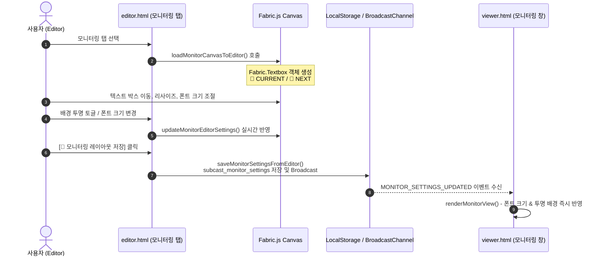

# 📄 에디터 모니터링 탭 자유 텍스트 스타일 편집 및 상태 분리 리팩토링 계획서
**Project:** Subcast Editor Monitoring System Refactoring  
**Author:** AI College Lead Architect & Professor  
**Date:** 2026-07-31  

---

## 1. 개요 및 배경 (Overview & Background)

현재 Subcast 에디터의 모니터링 탭에서는 모니터링 송출 화면의 레이아웃(위치 및 크기)을 캔버스에서 드래그하여 조절하는 기능이 1차 구현되어 있습니다. 그러나 현재 캔버스에 표시되는 모니터링 요소는 단색 사각형(`Fabric.Rect`) 형태의 고정적 도형으로 한정되어 있어, **텍스트의 글씨 크기(Font Size), 폰트 스타일, 배경 및 테두리의 투명화(Transparency)** 등 자유로운 디자인 연출에 제약이 존재합니다.

본 리팩토링의 핵심 목표는 다음 두 가지입니다:
1. **독립적인 모니터링 디자인 상태 유지**: 슬라이드 목록 클릭 및 슬라이드 원본 데이터(`projectData.slides`)에 절대 영향을 주지 않으면서 모니터링 탭 전용 캔버스 편집 환경 구축.
2. **텍스트 박스(`Fabric.Textbox`) 기반의 자유 디자인 및 송출 연동**: 단색 도형 대신 배경/테두리를 투명하게 설정할 수 있는 텍스트 박스를 활용하고, 캔버스 및 모니터링 패널에서 조절한 글씨 크기 및 디자인 속성이 송출 미리보기(`viewer.html?mode=monitor` 및 `presenter.html`)에 실시간으로 연동되도록 보장.

---

## 2. 현행 아키텍처 분석 및 문제점 (Current Architecture Analysis)

### 2.1 코드 라인별 현황
- **[frontend/js/editor.js (L7057-L7079)](file:///C:/cli-develop/subcast/frontend/js/editor.js#L7057-L7079)**: `createMonitorRectBox()` 함수에서 `Fabric.Rect` 객체를 사용하여 🔴 CURRENT 카드와 🔵 NEXT 카드를 생성합니다. 이는 단색 배경과 테두리를 가진 고정 사각형입니다.
- **[frontend/js/editor.js (L213-L223)](file:///C:/cli-develop/subcast/frontend/js/editor.js#L213-L223)** & **[(L459-L463)](file:///C:/cli-develop/subcast/frontend/js/editor.js#L459-L463)**: 탭 전환 및 슬라이드 선택 시 `isMonitorEditMode` 플래그를 통해 모니터링 캔버스를 클리어하고 `restoreNormalCanvas()`로 일반 슬라이드를 복원하는 상태 분리가 이루어져 있습니다.
- **[frontend/js/viewer.js (L622-L683)](file:///C:/cli-develop/subcast/frontend/js/viewer.js#L622-L683)** & **[frontend/js/presenter.js (L509-L540)](file:///C:/cli-develop/subcast/frontend/js/presenter.js#L509-L540)**: `subcast_monitor_settings` 로컬 스토리지 데이터에서 위치 수치(`leftPct`, `topPct`, `widthPct`, `heightPct`)와 단순 배경/글자색만 읽어 렌더링하고 있으며, 폰트 크기(`fontSize`) 및 투명 배경 처리 로직이 부재합니다.

### 2.2 한계점 요약
1. 캔버스 렌더링 요소가 도형(`Rect`)에 국한되어 글씨 크기 변환 및 텍스트 시각적 피드백 불가능.
2. 배경/테두리 투명화 조절 옵션 UI 부재.
3. 캔버스 텍스트 박스 스케일 변경 시 모니터링 송출 창으로의 폰트 크기($fontSize$) 데이터 전송 파이프라인 부재.

---

## 3. 데이터 모델 및 수학적 스케일링 공식 (Data Model & Math Formulation)

### 3.1 데이터 모델 스키마 확장 (`subcast_monitor_settings`)

```json
{
  "layoutMode": "custom_canvas",
  "bibleMode": "summary",
  "currentBg": "transparent",
  "currentTextColor": "#FFFFFF",
  "nextBg": "transparent",
  "nextTextColor": "#A0A0A0",
  "currentBox": {
    "leftPct": 5.0,
    "topPct": 5.0,
    "widthPct": 90.0,
    "heightPct": 42.0,
    "fontSize": 28,
    "isTransparentBg": true,
    "textColor": "#FFFFFF",
    "bgColor": "transparent"
  },
  "nextBox": {
    "leftPct": 5.0,
    "topPct": 51.0,
    "widthPct": 90.0,
    "heightPct": 42.0,
    "fontSize": 22,
    "isTransparentBg": true,
    "textColor": "#A0A0A0",
    "bgColor": "transparent"
  }
}
```

### 3.2 폰트 크기 및 스케일링 수학 공식

Fabric.js 캔버스에서 사용자가 텍스트 박스의 크기를 조절할 때, 객체의 실제 바운딩 박스 크기 $W_{\text{actual}}, H_{\text{actual}}$와 폰트 크기 $S_{\text{effective}}$는 다음과 같이 계산됩니다:

$$ W_{\text{actual}} = W_{\text{base}} \times \text{scaleX} $$
$$ H_{\text{actual}} = H_{\text{base}} \times \text{scaleY} $$

드래그 스케일링으로 변경된 유효 글씨 크기(Effective Font Size) $S_{\text{effective}}$는 다음과 같으며, 저장 시 정수형 폰트 크기로 정규화(Normalization)합니다:

$$ S_{\text{effective}} = \text{round}\left( S_{\text{base}} \times \text{scaleY} \right) $$

캔버스 상대 비율 좌표 파라미터 ($W_{base} = 768, H_{base} = 432$ 기준):

$$ X_{\% } = \text{clamp}\left(0, 95, \frac{\text{left}}{W_{base}} \times 100\right) $$
$$ Y_{\% } = \text{clamp}\left(0, 95, \frac{\text{top}}{H_{base}} \times 100\right) $$

---

## 4. 시스템 데이터 흐름 및 아키텍처 다이어그램



---

## 5. 단계별 구체적 수정 작업 명세 (Implementation Tasks)

### Task 1: UI 패널 확장 ([frontend/editor.html](file:///C:/cli-develop/subcast/frontend/editor.html#L572-L630))
1. **투명 배경 체크박스 토글 추가**:
   - `🔴 현재 슬라이드` 및 `🔵 다음 슬라이드` 배경색 설정 영역 옆에 `[ ] 배경 투명` 체크박스 추가.
2. **글씨 크기(Font Size) 수치 조절 입력 필드 추가**:
   - CURRENT / NEXT 각각의 폰트 크기를 직접 입력할 수 있는 `<input type="number" id="num-monitor-curr-fontsize">` 필드 신설.

### Task 2: 캔버스 객체 생성 및 동동 로직 개편 ([frontend/js/editor.js](file:///C:/cli-develop/subcast/frontend/js/editor.js#L7057-L7304))
1. **`createMonitorTextbox()` 함수 신설**:
   - `Fabric.Rect` 대신 `Fabric.Textbox`를 활용한 캔버스 요소 생성기 작성.
   - 기본 텍스트:
     - CURRENT: `"🔴 CURRENT (현재 송출 슬라이드 텍스트 예시)"`
     - NEXT: `"🔵 NEXT (다음 슬라이드 텍스트 미리보기 예시)"`
   - `fill`: 배경색 또는 `'transparent'` (투명 배경 활성화 시).
   - `stroke`: 바운딩 안내선 표시 (선택 시 또는 투명 모드 시 구분용).
2. **`loadMonitorCanvasToEditor()` 개편**:
   - 저장된 `fontSize`, `isTransparentBg` 값 읽기 및 텍스트 박스 객체 초기화.
3. **`saveMonitorSettingsFromEditor()` 및 `applyMonitorNumericInputs()` 개편**:
   - 텍스트 박스의 폰트 크기 및 스케일 상태를 `fontSize` 속성으로 올바르게 직렬화(Serialization).

### Task 3: 모니터링 송출 미리보기 연동 ([frontend/js/viewer.js](file:///C:/cli-develop/subcast/frontend/js/viewer.js#L622-L683))
1. **`renderMonitorView()` 폰트 및 투명도 반영**:
   - `settings.currentBox.fontSize` 및 `settings.nextBox.fontSize`를 읽어 `monitor-current-text` 및 `monitor-next-text` DOM 요소의 `font-size`에 적용.
   - `isTransparentBg`가 `true`이거나 `bgColor`가 `'transparent'`일 경우 `backgroundColor = 'transparent'` 처리.

### Task 4: 슬라이드 데이터 완전 분리 검증
1. `selectSlideForEdit()` 실행 시 모니터링 전용 패브릭 객체들이 슬라이드 요소(`projectData.slides`)로 유출되지 않음을 보장하는 캔버스 클리어 및 상태 복원 검증.

---

## 6. 테스트 및 검증 계획 (Testing & CI Protocol)

`user_global` 규칙에 따른 구조적 테스트 계획:

1. **테스트 스크립트 작성**:
   - `tests/test_monitoring_settings.py` 작성
   - `subcast_monitor_settings` JSON 데이터 구조 검증 및 스케일링 수식 연산 유닛 테스트.
2. **실행 로깅**:
   - 테스트 실행 결과를 `test_results/test_monitoring_result.log`에 저장.
3. **.gitignore 검증**:
   - `test_results/` 폴더가 `.gitignore`에 등록되어 있는지 재확인.

---

## 7. 기대 효과 (Expected Outcomes)

- **디자인 자유도 극대화**: 모니터링 탭에서도 텍스트 박스 단위의 폰트 크기 조절 및 투명 배경 연출 가능.
- **슬라이드 원본 무결성 보장**: 모니터링 편집이 실제 예배/슬라이드 내용에 어떤 영향도 주지 않도록 완벽히 상태가 분리됨.
- **실시간 반응형 미리보기**: 에디터에서 수정한 글씨 크기와 레이아웃 스타일이 모니터링 창(`viewer.html`)에 즉각 동기화됨.
