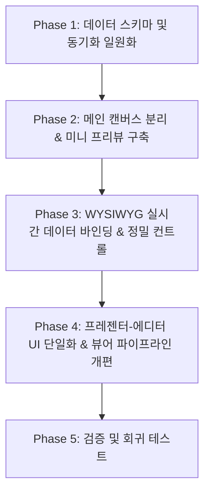

# 📋 모니터링 화면 연출 편집기 리팩토링 및 기능 개선 계획서
*(Monitoring Screen Display Editor Refactoring & Enhancement Plan)*

---

## 1. 개요 (Overview)

본 계획서는 Subcast 애플리케이션의 **에디터 페이지 내 모니터링 화면 연출 편집기**에서 발견된 캔버스 상태 오염, 데이터 스키마 파편화, 실시간 동기화 부재, UX/UI 직관성 저해 요소를 근본적으로 해결하기 위한 종합 리팩토링 전략을 기술합니다.

기존 메인 슬라이드 캔버스를 파괴적으로 재사용하던 구조에서 **독립 미니 프리뷰(Standalone Mini Preview Component)** 아키텍처로 전환하며, Multi-Tab 간 실시간 데이터 동기화 파이프라인 및 WYSIWYG(What You See Is What You Get) 기반 정밀 조작 환경을 구축하는 것을 목적으로 합니다.

---

## 2. 현행 문제점 분석 종합 (Current Issues)

### 2.1 아키텍처 및 기능적 결함 (Architectural & Functional Bugs)
1. **캔버스 상태 파괴 (Canvas State Corruption)**
   - [`editor.js`](file:///C:/cli-develop/subcast/frontend/js/editor.js#L213-L223)의 탭 전환 시 `canvas.clear()`로 메인 슬라이드 캔버스를 전역 삭제한 후 모니터링 드래그 박스(`🔴 CURRENT`, `🔵 NEXT`)를 덮어씌움.
   - 탭 이동 중 슬라이드 조작/이벤트(Undo/Redo, Layer 조작) 발생 시 캔버스 객체 트리가 완전히 파손됨.
2. **데이터 스키마 파편화 및 덮어쓰기 (Data Schema Desynchronization)**
   - [`editor.js`](file:///C:/cli-develop/subcast/frontend/js/editor.js#L7148), [`presenter.js`](file:///C:/cli-develop/subcast/frontend/js/presenter.js#L666), [`viewer.js`](file:///C:/cli-develop/subcast/frontend/js/viewer.js#L327) 간 `subcast_monitor_settings` 스키마 불일치.
   - 자유 드래그 좌표(`currentBox: { leftPct, topPct, ... }`)와 고정 비율 라디오 모드(`layout: "5:5" | "7:3"`) 간 데이터 덮어쓰기(Race Condition) 발생.
3. **실시간 동기화 채널 미비 (No Real-Time Sync)**
   - 에디터에서 레이아웃/색상 변경 후 저장 시 모니터 뷰어 창(`viewer.html?mode=monitor`)으로 실시간 브로드캐스팅(Broadcasting) 신호 미송신.

### 2.2 UX 및 UI 직관성 문제 (User Experience & Interface Issues)
1. **정신적 모델(Mental Model) 붕괴 및 불안감 유발**
   - 탭 전환만으로 제작 중인 슬라이드가 완전히 사라져 "슬라이드가 삭제되었다"는 착각(Data Loss Panic)을 유발.
2. **실제 데이터 미리보기(WYSIWYG) 부재**
   - 사각형 박스에 하드코딩된 단색 및 더미 라벨만 표출되어 실제 슬라이드(성경 구절, 찬양 가사)의 폰트/줄바꿈/색상 피드백 불가.
3. **컨트롤 요소 파편화**
   - 프레젠터 모달과 에디터 좌측 패널의 설정 항목(성경 구절 표시 옵션, 레이아웃 옵션)이 상이하여 일관성(Consistency) 결여.
4. **정밀 조작 툴(Precision Controls) 부재**
   - 단순 마우스 드래그 조작만 지원하여 스냅(Snap) 정렬, 중앙 정렬, exact $X, Y, W, H$ 수치 입력 인풋 부재.

---

## 3. 단계별 개선 계획 (Detailed Action Plan)



---

### 🟢 Phase 1: 데이터 스키마 표준화 및 동기화 채널 구축

#### 1.1 표준 모니터링 데이터 인터페이스 (`MonitorConfig`) 설계
`subcast_monitor_settings` 키에 저장되는 데이터 스키마를 아래와 같이 단일 표준 구조체로 통일합니다.

```typescript
interface MonitorBoxConfig {
  leftPct: number;   // 0 ~ 100 (%)
  topPct: number;    // 0 ~ 100 (%)
  widthPct: number;  // 5 ~ 100 (%)
  heightPct: number; // 5 ~ 100 (%)
  bgColor: string;   // Hex Color Code (e.g., "#1E1E1E")
  textColor: string; // Hex Color Code (e.g., "#FFFFFF")
}

interface MonitorConfig {
  version: "2.0";
  layoutMode: "preset" | "custom"; // preset(5:5, 7:3 등) 또는 custom(자유 드래그)
  presetRatio: "5:5" | "7:3" | "3:7";
  bibleMode: "summary" | "ref_only" | "full";
  fontSizePct: number; // 50 ~ 300 (%)
  currentBox: MonitorBoxConfig;
  nextBox: MonitorBoxConfig;
}
```

#### 1.2 실시간 동기화 파이프라인 (Multi-Tab Sync) 구현
- 브라우저의 `BroadcastChannel API` (채널명: `subcast_monitor_channel`) 및 `window.addEventListener('storage')` 이벤트를 도입합니다.
- 에디터에서 모니터링 설정 변경 즉시 메시지를 발송하고, 뷰어(`viewer.js`)는 이를 수신하여 **새로고침 없이 0.1초 내 실시간 렌더링**을 갱신합니다.

---

### 🟢 Phase 2: 에디터 메인 캔버스 보호 & 독립 미니 프리뷰(Mini Preview) 전환

#### 2.1 메인 캔버스 클리어 로직 완전 제거
- [`editor.js`](file:///C:/cli-develop/subcast/frontend/js/editor.js#L213-L223)의 `switchLeftTab()`에서 모니터링 탭 선택 시 메인 Fabric.js 캔버스(`canvas.clear()`)를 호출하는 로직을 완전히 삭제합니다.
- 메인 캔버스는 사용자가 작성 중인 슬라이드 화면을 그대로 유지합니다.

#### 2.2 독립 샌드박스 패널 (Container-bound Mini Renderer) 구축
- 에디터 좌측 사이드바 패널([`editor.html`](file:///C:/cli-develop/subcast/frontend/editor.html#L529-L598)) 내부에 $16:9$ 화면 비율을 유지하는 **독립 미니 캔버스(또는 Interactive SVG/DOM 샌드박스)** 영역을 신설합니다.
- 미니 프리뷰 내에서 마우스 드래그/리사이즈 이벤트를 상위 패널 밖으로 이탈하지 않도록 격리(Scoped Sandbox Event) 처리합니다.

---

### 🟢 Phase 3: WYSIWYG 실시간 데이터 바인딩 및 정밀 조작 툴 추가

#### 3.1 실제 슬라이드 컨텐츠 바인딩 (WYSIWYG Feedback)
- 더미 라벨 대신, 현재 에디터에서 선택된/송출 중인 슬라이드의 **실제 텍스트(성경 구절/찬양 가사)** 및 **다음 슬라이드 미리보기 텍스트**를 미니 프리뷰 상자 내부에 동적으로 렌더링합니다.
- 설정된 글자 색상(`textColor`), 배경 색상(`bgColor`), 성경 표출 모드(`bibleMode`)가 미니 프리뷰 박스에 즉각 반영되어 최종 연출을 한눈에 파악할 수 있도록 합니다.

#### 3.2 정밀 조작 컨트롤러 (Precision Inspector Controls)
- 마우스 미세 조작의 한계를 보완하기 위해 수치 제어 패널을 패널 하단에 추가합니다.
  - **위치 및 크기 인풋:** `CURRENT` / `NEXT` 상자의 $X(\%), Y(\%), W(\%), H(\%)$ 입력 폼.
  - **정렬 도구 버튼:**
    - 🎯 **중앙 정렬 (Center Align)**
    - 📐 **가로/세로 5:5 균등 분할**
    - 🔄 **상하 스왑 (Swap Current/Next)**

---

### 🟢 Phase 4: 프레젠터-에디터 UI/UX 통합 및 뷰어 파이프라인 개편

#### 4.1 UI/UX 일관성(Consistency) 확보
- 프레젠터 페이지([`presenter.html`](file:///C:/cli-develop/subcast/frontend/presenter.html#L130))의 모니터링 설정 모달과 에디터 좌측 패널의 컨트롤 요소를 동일한 컴포넌트 구조로 재구성합니다.
- 설정 옵션 명칭 및 아이콘, 레이아웃 선택 프리셋을 단일 인터페이스 규격으로 통일합니다.

#### 4.2 뷰어 렌더링 엔진([`viewer.js`](file:///C:/cli-develop/subcast/frontend/js/viewer.js#L603)) 개편
- `renderMonitorView()` 함수에서 `MonitorConfig` 표준 스키마를 수신하여 `layoutMode === "custom"`인 경우 `leftPct`, `topPct` 기반 Absolute 포지셔닝을 적용하고, `layoutMode === "preset"`인 경우 Flexbox 비율을 적용하도록 렌더링 분기 로직을 일관성 있게 다듬습니다.

---

## 4. 작업 구현 세부 이행표 (Task Checklist)

| Phase | 세부 작업 항목 | 대상 파일 | 비고 |
| :--- | :--- | :--- | :--- |
| **Phase 1** | `MonitorConfig` 표준 인터페이스 정의 및 헬퍼 함수 작성 | `frontend/js/editor.js`<br>`frontend/js/presenter.js`<br>`frontend/js/viewer.js` | 스키마 일원화 |
| **Phase 1** | `BroadcastChannel` 기반 Multi-Tab 실시간 동기화 수발신기 구현 | `frontend/js/editor.js`<br>`frontend/js/viewer.js` | 실시간 반영 |
| **Phase 2** | `switchLeftTab('panel-monitor')` 내 메인 캔버스 파괴 로직 제거 | `frontend/js/editor.js` | 메인 캔버스 보호 |
| **Phase 2** | 에디터 패널 내 독립 16:9 미니 프리뷰 컨테이너 UI 구축 | `frontend/editor.html`<br>`frontend/css/editor.css` | UI 격리 |
| **Phase 3** | 실제 슬라이드 데이터 추출 및 미니 프리뷰 WYSIWYG 렌더링 구현 | `frontend/js/editor.js` | WYSIWYG 피드백 |
| **Phase 3** | $X, Y, W, H$ 수치 입력 인풋 및 정렬/스왑 버튼 UI 추가 | `frontend/editor.html`<br>`frontend/js/editor.js` | 정밀 조작 툴 |
| **Phase 4** | 프레젠터 모달 및 에디터 패널 간 설정 UI 통합 및 뷰어 렌더러 정비 | `frontend/js/presenter.js`<br>`frontend/js/viewer.js` | 일관성 확보 |
| **Phase 5** | 단위 테스트 작성 (`tests/test_monitor_settings.py`) 및 수동 검증 | `tests/` | QA & CI/CD |

---

## 5. 검증 및 테스트 계획 (Verification & QA Plan)

1. **단위 테스트 (Unit Testing)**
   - `tests/test_monitor_settings.py`를 신설하여 `MonitorConfig` 데이터 유효성 검증(Validation) 및 default값 파싱 테스트 작성.
2. **수동 시나리오 테스트 (Manual QA Scenarios)**
   - **시나리오 A (메인 캔버스 안전성):** 모니터링 탭 진입 ➔ 다른 탭 이동 ➔ 메인 슬라이드 요소 드래그 및 Undo/Redo 실행 ➔ 슬라이드 데이터 손상 없음 확인.
   - **시나리오 B (실시간 동기화):** 모니터 뷰어 창(`viewer.html?mode=monitor`)을 2차 모니터에 띄운 후 에디터 모니터링 탭에서 색상 변경 ➔ 0.1초 내 실시간 색상 반영 확인.
   - **시나리오 C (WYSIWYG 및 수치 조작):** $X, Y, W, H$ 인풋 값 조절 ➔ 미니 프리뷰 박스와 수치가 상호 동기화되는지 검증.

---

## 6. 참고 문헌 (References)
- [Fabric.js Options & Object Isolation Guide](https://fabricjs.com/docs/)
- [MDN Web Docs - BroadcastChannel API](https://developer.mozilla.org/en-US/docs/Web/API/BroadcastChannel)
- [MDN Web Docs - Web Storage API](https://developer.mozilla.org/en-US/docs/Web/API/Web_Storage_API)
