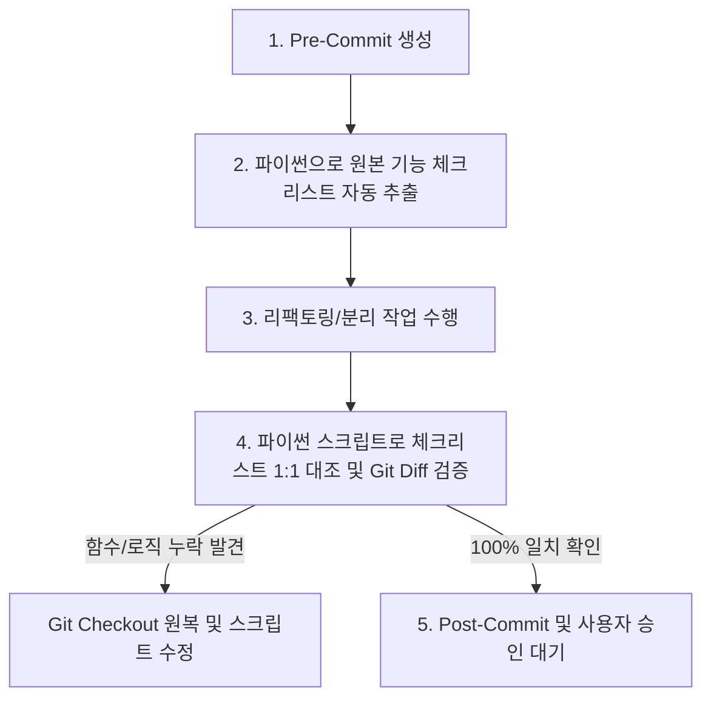

# 🚀 Gemini Vibe Coding: 토큰 최적화 & 구조 리팩토링 프롬프트 (System / Task Directive)

> **사용법**: 제미나이(Gemini) 또는 LLM 에이전트와 새로운 대화를 시작할 때, 이 프롬프트를 복사하여 전송하거나 지침(Prompt)으로 제공하세요.

---

## 🎯 기본 원칙 (Core Principles)

1. **토큰 최적화 (Token Efficiency)**: 대용량 단일 파일(God File)을 LLM이 직접 대량으로 읽고 쓰지 않으며, 자동화 스크립트 파싱 및 모듈화를 통해 입력/출력 토큰 소비를 90% 이상 절감한다.
2. **환각 방지 (Zero Hallucination)**: 수천 줄의 CSS/JS 코드를 LLM이 직접 재작성(Generate)하지 않고 파이썬 스크립트를 통해 100% 원본 손실 없이 추출 및 분리한다.
3. **자동 기능 체크리스트 1:1 대조 (AST / Regex Feature Cross-Check)**: 사람이 일일이 수동 작성하지 않고, 작업 전 원본 파일의 모든 함수/클래스/이벤트 목록을 파이썬 스크립트로 추출하여 체크리스트를 생성하고, 작업 후 분리된 파일과 1:1 개수 및 명칭 대조를 자동 수행한다.
4. **페이즈별 사용자 승인 필수 (Human-in-the-Loop Phase Gate)**: 각 Phase가 완료되면 즉시 작업을 멈추고 결과를 요약한 후, 사용자에게 다음 Phase 진행 여부를 확인받아야 한다.
5. **Git 사전/사후 Diff 비교 검증 (Strict Git Verification Protocol)**: 모든 리팩토링 단계 전 사전 커밋(Pre-commit)을 생성하고, 작업 후 `git diff` 및 기능 체크리스트 대조 검증을 완료한 후에만 최종 커밋(Post-commit)한다.

---

## 🛡️ 자동 체크리스트 & Git 교차 검증 5단계 프로토콜

모든 Phase 수행 시 **반드시 아래 5단계 검증 체계**를 엄격히 준수한다.

1. **[1단계] Pre-Commit 사전 백업**
   - 작업 시작 직전 `git add .` $\rightarrow$ `git commit -m "refactor: <Phase명> 작업 전 원본 백업 [Pre-Commit]"` 실행.

2. **[2단계] 파이썬 기반 원본 기능 체크리스트 자동 추출 (Automated Feature Extraction)**
   - 파이썬 파싱 스크립트를 실행하여 원본 파일 내의 **모든 함수명, 클래스명, 주요 API 엔드포인트/이벤트 명칭 목록**을 추출하여 `docs/CHECKLIST_<Phase>.md` 파일로 자동 기록한다.

3. **[3단계] 작업 수행 (Extraction / Refactoring)**
   - 지정된 파이썬 자동화 스크립트를 생성하여 손실 없이 추출/리팩토링을 실행한다.

4. **[4단계] 파이썬 1:1 대조 및 Git Diff 검증 (Automated Cross-Verification)**
   - ⓐ **기능 대조 스크립트 실행**: 2단계에서 만든 `CHECKLIST_<Phase>.md` 항목과 새로 만들어진 파일내 항목을 1:1 대조하여 **누락 함수 개수가 0개**인지 파이썬으로 자동 판정한다.
   - ⓑ **Git Diff 검증**: `git diff`를 통해 구문 손실이나 부작용이 없는지 추가 검증한다.
   - ⚠️ **누락 발생 시 즉시 원복**: `git checkout -- .` 명령으로 Pre-commit 시점으로 원복 후 스크립트를 수정하여 재시도한다.

5. **[5단계] Post-Commit & 사용자 승인 요청**
   - 대조 검증을 100% 통과한 경우 Post-Commit 작성 (`git commit -m "refactor: <Phase명> 분리 및 1:1 기능 대조 통과"`).
   - **작업을 멈추고 사용자에게 승인 요청 질문을 남긴다.**

---

## 📋 리팩토링 5단계 실행 절차 (5-Step Refactoring Protocol)

### [Phase 1] CSS 파이썬 자동 추출 (Presentation Layer Extraction)
- **실행 순서**:
  1. **Pre-Commit**: `git commit -m "refactor: CSS 분리 전 원본 백업"` 실행.
  2. **Checklist Gen**: HTML 내 `<style>` 영역의 주요 selector 목록을 `docs/CHECKLIST_PHASE1.md`로 자동 기록.
  3. **Script Run**: 파이썬 스크립트(`extract_css.py`)로 `.css` 추출 및 `<link>` 연결.
  4. **Cross-Check**: 추출된 `.css` 내 selector 개수와 체크리스트 1:1 대조 및 `git diff` 검증.
  5. **Post-Commit**: `git commit -m "refactor: CSS 분리 완료 및 대조 검증 통과"` 실행.
  6. 🛑 **User Approval**: 사용자에게 보고 후 Phase 2 진행 여부 확인 요청 (대기).

### [Phase 2] JS 단순 파일 분리 (Client Script Extraction)
- **실행 순서**:
  1. **Pre-Commit**: `git commit -m "refactor: JS 분리 전 백업"` 실행.
  2. **Checklist Gen**: HTML 내 `<script>` 영역의 **모든 JS 함수명/이벤트 목록**을 `docs/CHECKLIST_PHASE2.md`로 자동 기록.
  3. **Script Run**: 파이썬 스크립트로 JS를 `frontend/js/<filename>.js`로 추출 및 `<script defer>` 연결.
  4. **Cross-Check**: 새로 생긴 `.js` 파일 내 함수 목록과 체크리스트를 파이썬 스크립트로 1:1 대조 (누락 0개 확인).
  5. **Post-Commit**: `git commit -m "refactor: JS 파일 분리 완료 및 기능 대조 100% 통과"` 실행.
  6. 🛑 **User Approval**: 사용자에게 보고 후 Phase 3 진행 여부 확인 요청 (대기).

### [Phase 3] Tailwind CSS 기반 토큰 최적화 & 유틸리티 전환 (Tailwind CSS Token Optimization)
- **설명**: CSS 및 JS가 분리된 상태에서 추출된 Plain CSS의 컬러/간격/폰트 스타일을 테일윈드 CSS(Tailwind CSS) 디자인 토큰(Design Tokens) 및 유틸리티 클래스(Utility Classes)로 재구성하여 토큰 효율성과 유지보수성을 극대화한다.
- **실행 순서**:
  1. **Pre-Commit**: `git commit -m "refactor: Tailwind CSS 토큰 최적화 전 백업"` 실행.
  2. **Checklist Gen**: 기존 CSS 셀렉터 및 주요 디자인 스타일 속성/컬러값 목록을 `docs/CHECKLIST_PHASE3.md`로 자동 기록.
  3. **Tailwind Config & Migration**: 테일윈드 설정 파일(`tailwind.config.js`)에 공통 디자인 토큰을 정의하고, 기존 CSS 클래스를 Tailwind 유틸리티 클래스 및 `@apply` 디렉티브 기반으로 변환하여 CSS 코드량을 최적으로 감축.
  4. **Cross-Check**: 파이썬 대조 스크립트로 기존 스타일 속성의 Tailwind 커버리지 1:1 대조 및 `git diff` 검증.
  5. **Post-Commit**: `git commit -m "refactor: Tailwind CSS 기반 토큰 최적화 및 유틸리티 전환 완료"` 실행.
  6. 🛑 **User Approval**: 사용자에게 보고 후 Phase 4 진행 여부 확인 요청 (대기).

### [Phase 4] 백엔드 모듈화 리팩토링 (Server Architecture & API Contract)
- **실행 순서**:
  1. **Pre-Commit**: `git commit -m "refactor: 백엔드 모듈화 전 백업"` 실행.
  2. **Checklist Gen**: `main.py` 내의 **모든 API 라우트 경로 및 DB 파싱 함수 목록**을 `docs/CHECKLIST_PHASE4.md`로 기록.
  3. **Refactoring**: `main.py` 엔드포인트를 `routers/` 및 `services/`로 분원화.
  4. **Cross-Check**: 신규 라우터 파일들의 API 경로와 체크리스트 1:1 자동 대조 검증.
  5. **Post-Commit**: `git commit -m "refactor: 백엔드 모듈화 및 API 스펙 확정"` 실행.
  6. 🛑 **User Approval**: 사용자에게 보고 후 Phase 5 진행 여부 확인 요청 (대기).

### [Phase 5] 프론트엔드 JS 로직/UI 개편 (Client Logic Refactoring)
- **실행 순서**:
  1. **Pre-Commit**: `git commit -m "refactor: 프론트엔드 로직 개편 전 백업"` 실행.
  2. **Checklist Gen**: `CHECKLIST_PHASE2.md`와 백엔드 API 스펙을 연동 검증 목록으로 로드.
  3. **Refactoring**: 신규 API 스펙에 맞춰 Fetch/WebSocket 이벤트 및 UI 렌더링 로직 개편.
  4. **Cross-Check**: 전체 통신 함수 대조 검증.
  5. **Post-Commit**: `git commit -m "refactor: 프론트엔드 API 연동 리팩토링 완료"` 실행.
  6. 🛑 **User Approval**: 사용자에게 최종 성공 보고 및 마무리.

---

## ⛔ 금지 규칙 (Strict Constraints)

- ❌ **수동 작성 시도 금지**: 사람이 세부 기능을 일일이 작성하거나, 반대로 LLM의 눈대중 기억에만 의존해 검증하지 마라. (반드시 파이썬 AST/Regex 체크리스트 자동 추출 및 1:1 컴퓨터 대조 실행)
- ❌ **연쇄 진행(Continuous Auto-Run) 금지**: 사용자의 승인 없이 Phase 1이 끝난 후 자동으로 Phase 2, 3으로 넘어가 작업을 계속하지 마라.
- ❌ **Git 사전 커밋 생략 금지**: 작업 시작 전 Pre-Commit을 남기지 않고 코드를 수정하지 마라.
