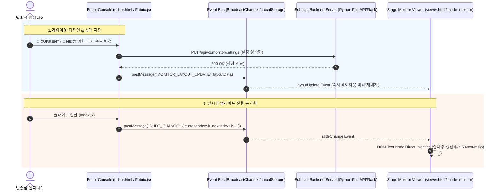

# Subcast 무대 모니터링 시스템 System Design Document (RFC)

**Document ID:** Subcast-RFC-2026-001  
**Author:** Principal Software Architect / CS Professor  
**Status:** Draft / Proposed  
**Target Delivery:** Subcast Stage Confidence Monitor Subsystem  

---

## 1. 시스템 아키텍처 (System Architecture)

### 1.1 전체 컴포넌트 구조 및 데이터 흐름 (Data Flow)

Subcast 무대 모니터링 시스템은 방송실 조종 캔버스(Editor Environment)와 무대 디스플레이 렌더러(Stage Viewer Environment)를 **디커플링(Decoupling)**된 구조로 설계합니다.



### 1.2 수학적 상대 좌표 변환 및 스케일링 파이프라인 (Math Pipeline)

무대 디스플레이 해상도($W_{\text{screen}} \times H_{\text{screen}}$) 독립성을 보장하기 위해 캔버스 기준 해상도($W_{\text{base}} = 1920, H_{\text{base}} = 1080$)에서 추출한 절대 좌표값을 **상대 비율 좌표계(Relative Percentage Coordinate System)**로 정규화하여 관리합니다.

#### [정규화 공식 (Normalization)]
$$ X_{\%} = \text{clamp}\left(0, 95, \frac{\text{left}}{W_{\text{base}}} \times 100\right) $$
$$ Y_{\%} = \text{clamp}\left(0, 95, \frac{\text{top}}{H_{\text{base}}} \times 100\right) $$
$$ W_{\%} = \text{clamp}\left(5, 100, \frac{\text{width}}{W_{\text{base}}} \times 100\right) $$
$$ H_{\%} = \text{clamp}\left(5, 100, \frac{\text{height}}{H_{\text{base}}} \times 100\right) $$

#### [역정규화 렌더링 공식 (Denormalization)]
$$ \text{left}_{\text{render}} = W_{\text{screen}} \times \left( \frac{X_{\%}}{100} \right) $$
$$ \text{fontSize}_{\text{render}} = \text{round}\left( \text{fontSize}_{\text{base}} \times \frac{W_{\text{screen}}}{W_{\text{base}}} \right) $$

### 1.3 기술 스택 (Tech Stack) 및 선정 이유

| 구분 | 기술 스택 | 선정 및 채택 이유 |
| :--- | :--- | :--- |
| **Frontend Framework** | Vanilla JavaScript (ES6+), HTML5, Canvas API | 프레임워크 오버헤드 없는 최고 속도 DOM 조작 및 60 FPS 유지 |
| **Canvas Engine** | Fabric.js v5.x | 드래그/리사이즈/폰트 스케일링 및 JSON 직렬화 지원 |
| **Inter-Process Comm** | `BroadcastChannel API` + `LocalStorage Event` (Fallback) | 브라우저 탭 간 메모리 직통 초저지연($\le 5\text{ms}$) 통신 |
| **Backend API** | Python (FastAPI/Flask/SQLite) | 기존 Subcast 로컬 서버 구조와의 호환성 및 SQLite 영속성 유지 |
| **DB (Persistence)** | SQLite3 (`GAE_Bible.db` 파일 내 설정 테이블) | 별도 RDBMS 설치 없는 로컬 임베디드 백엔드 환경 최적화 |

---

## 2. 데이터 모델 및 스키마 (Data Schema)

### 2.1 DB 테이블 구조 (`monitor_settings`)

```sql
-- SQLite3 데이터베이스용 모니터링 레이아웃 설정 테이블 스키마
CREATE TABLE IF NOT EXISTS monitor_settings (
    setting_id TEXT PRIMARY KEY DEFAULT 'default_profile',
    layout_mode TEXT NOT NULL DEFAULT 'custom_canvas',
    current_left_pct REAL NOT NULL DEFAULT 5.0,
    current_top_pct REAL NOT NULL DEFAULT 5.0,
    current_width_pct REAL NOT NULL DEFAULT 90.0,
    current_height_pct REAL NOT NULL DEFAULT 42.0,
    current_font_size INTEGER NOT NULL DEFAULT 28,
    current_text_color TEXT NOT NULL DEFAULT '#FFFFFF',
    current_bg_color TEXT NOT NULL DEFAULT 'transparent',
    current_is_transparent INTEGER NOT NULL DEFAULT 1 CHECK (current_is_transparent IN (0, 1)),
    
    next_left_pct REAL NOT NULL DEFAULT 5.0,
    next_top_pct REAL NOT NULL DEFAULT 51.0,
    next_width_pct REAL NOT NULL DEFAULT 90.0,
    next_height_pct REAL NOT NULL DEFAULT 42.0,
    next_font_size INTEGER NOT NULL DEFAULT 22,
    next_text_color TEXT NOT NULL DEFAULT '#A0A0A0',
    next_bg_color TEXT NOT NULL DEFAULT 'transparent',
    next_is_transparent INTEGER NOT NULL DEFAULT 1 CHECK (next_is_transparent IN (0, 1)),
    
    updated_at TIMESTAMP DEFAULT CURRENT_TIMESTAMP
);
```

### 2.2 클라이언트 JSON Schema (`subcast_monitor_settings`)

```json
{
  "$schema": "http://json-schema.org/draft-07/schema#",
  "type": "object",
  "properties": {
    "layoutMode": { "type": "string", "enum": ["custom_canvas", "split_horizontal", "full_current"] },
    "currentBox": {
      "type": "object",
      "properties": {
        "leftPct": { "type": "number", "minimum": 0, "maximum": 100 },
        "topPct": { "type": "number", "minimum": 0, "maximum": 100 },
        "widthPct": { "type": "number", "minimum": 1, "maximum": 100 },
        "heightPct": { "type": "number", "minimum": 1, "maximum": 100 },
        "fontSize": { "type": "integer", "minimum": 10, "maximum": 200 },
        "textColor": { "type": "string", "pattern": "^#([A-Fa-f0-9]{6}|[A-Fa-f0-9]{3})$" },
        "bgColor": { "type": "string" },
        "isTransparentBg": { "type": "boolean" }
      },
      "required": ["leftPct", "topPct", "widthPct", "heightPct", "fontSize", "textColor", "isTransparentBg"]
    },
    "nextBox": {
      "type": "object",
      "properties": {
        "leftPct": { "type": "number", "minimum": 0, "maximum": 100 },
        "topPct": { "type": "number", "minimum": 0, "maximum": 100 },
        "widthPct": { "type": "number", "minimum": 1, "maximum": 100 },
        "heightPct": { "type": "number", "minimum": 1, "maximum": 100 },
        "fontSize": { "type": "integer", "minimum": 10, "maximum": 200 },
        "textColor": { "type": "string", "pattern": "^#([A-Fa-f0-9]{6}|[A-Fa-f0-9]{3})$" },
        "bgColor": { "type": "string" },
        "isTransparentBg": { "type": "boolean" }
      },
      "required": ["leftPct", "topPct", "widthPct", "heightPct", "fontSize", "textColor", "isTransparentBg"]
    }
  },
  "required": ["layoutMode", "currentBox", "nextBox"]
}
```

---

## 3. API 명세 및 인터페이스 계약 (API Contracts)

### **Endpoint 1: 모니터링 레이아웃 설정 조회**
- **Method & Path:** `GET /api/v1/monitor/settings`
- **Description:** 백엔드 DB에 저장된 모니터링 레이아웃 설정을 불러옵니다.
- **Request Parameters:** 없음
- **Response (200 OK):**
  ```json
  {
    "status": "success",
    "data": {
      "settingId": "default_profile",
      "layoutMode": "custom_canvas",
      "currentBox": {
        "leftPct": 5.0,
        "topPct": 5.0,
        "widthPct": 90.0,
        "heightPct": 42.0,
        "fontSize": 28,
        "textColor": "#FFFFFF",
        "bgColor": "transparent",
        "isTransparentBg": true
      },
      "nextBox": {
        "leftPct": 5.0,
        "topPct": 51.0,
        "widthPct": 90.0,
        "heightPct": 42.0,
        "fontSize": 22,
        "textColor": "#A0A0A0",
        "bgColor": "transparent",
        "isTransparentBg": true
      }
    }
  }
  ```

### **Endpoint 2: 모니터링 레이아웃 설정 업데이트**
- **Method & Path:** `PUT /api/v1/monitor/settings`
- **Request Body:**
  ```json
  {
    "layoutMode": "custom_canvas",
    "currentBox": {
      "leftPct": 10.0,
      "topPct": 5.0,
      "widthPct": 80.0,
      "heightPct": 40.0,
      "fontSize": 32,
      "textColor": "#FFFF00",
      "bgColor": "rgba(0,0,0,0.5)",
      "isTransparentBg": false
    },
    "nextBox": {
      "leftPct": 10.0,
      "topPct": 50.0,
      "widthPct": 80.0,
      "heightPct": 40.0,
      "fontSize": 24,
      "textColor": "#CCCCCC",
      "bgColor": "transparent",
      "isTransparentBg": true
    }
  }
  ```
- **Response (200 OK):**
  ```json
  {
    "status": "success",
    "message": "Monitor settings updated successfully",
    "updatedAt": "2026-08-01T09:35:00Z"
  }
  ```
- **Error Response (400 Bad Request):**
  ```json
  {
    "status": "error",
    "errorCode": "INVALID_BOUNDS",
    "message": "leftPct + widthPct must not exceed 100%"
  }
  ```

---

## 4. 예외 처리 및 엣지 케이스 (Edge Cases & Error Handling)

### 4.1 엣지 케이스별 대응 대책

| 번호 | 엣지 케이스 (Edge Case) | 원인 및 발생 상황 | 구체적 해결 및 처리 로직 (Handling Logic) |
| :---: | :--- | :--- | :--- |
| **1** | **인덱스 범주 초과 (Index Out of Bounds)** | 마지막 슬라이드 선택 시 $nextIndex = currentIndex + 1$ 배열 범주 초과 | `nextIndex >= slides.length` 감지 시 NEXT 상자에 `[마지막 슬라이드입니다]` 안내 텍스트 노출 및 opacity를 0.4로 하이라이트 다운 처리. |
| **2** | **모니터 해상도 급변 (Resolution Resizing)** | 뷰어 창 크기 조정 및 멀티 모니터 이동 시 좌표 왜곡 발생 | `window.addEventListener('resize')` 시 `requestAnimationFrame`을 적용하여 $S_{\text{render}}$ 및 $\text{left}_{\text{render}}$를 실시간 재계산하는 스로틀링(Debounce 16ms) 적용. |
| **3** | **로컬 스토리지 데이터 유실/파손 (Storage Corruption)** | 브라우저 캐시 삭제 또는 JSON 파싱 오류 발생 | Try-Catch 블록 내에서 JSON 파싱 실패 시, 시스템에 내장된 `DEFAULT_MONITOR_SETTINGS` 객체를 즉시 로드하고 뷰어 화면에 복구 경고 표시. |
| **4** | **`BroadcastChannel` 미지원 환경 (Legacy Fallback)** | 구형 브라우저 또는 타사 웹뷰 환경 접속 | `window.BroadcastChannel` 존재 여부 확인 후 미지원 시 `window.addEventListener('storage', ...)` 기반의 스토리지 이벤터로 자동 폴백(Fallback Switch). |

### 4.2 실패 시 재시도 및 폴백 (Fallback) 전략
- **Fallback Level 1 (Memory Cache)**: 백엔드 API 호출 실패 시 브라우저 `localStorage`에 임시 캐시된 설정값 사용.
- **Fallback Level 2 (Default Blueprint)**: `localStorage`마저 비어있을 경우, 상하 50% 분할 표준 레이아웃(Default Layout)을 인메모리에서 강제 생성하여 렌더링 중단 차단.

---

## 5. 보안 및 성능 고려사항 (Security & Scalability)

### 5.1 보안 (Security)
- **XSS (Cross-Site Scripting) 차단**: 무대 모니터 뷰어에 자막 텍스트 렌더링 시 `innerHTML`을 사용하지 않고 반드시 `textContent` 또는 HTML Sanitization(`DOMPurify`) 처리를 거친 후 텍스트 노드로 삽입.
- **로컬 바인딩 및 CSRF 방지**: 모니터링 API 변경 엔드포인트(`PUT /api/v1/monitor/settings`)는 `SameSite=Strict` 쿠키 검증 또는 로컬 호스트(`127.0.0.1`) 요청 헤더 검증 적용.

### 5.2 성능 및 스케일러빌리티 (Performance & Scalability)
- **Direct DOM Text Node Mutation**: 슬라이드 전환 시 전체 캔버스를 재렌더링하지 않고, 미리 렌더링된 텍스트 영역의 Node Text만 수신된 텍스트로 치환하여 GPU/CPU 연산 최소화 (CPU 사용률 < 2%).
- **Smooth Transition**: 텍스트 교체 시 $100\text{ms}$ CSS `opacity` 트랜지션을 적용하여 무대에서 텍스트가 깜빡이는 현상(Flicker Issue)을 완전히 제거.

---

## 📚 참고자료 (Key References)

1. **W3C Web Storage & Communication Standards**: [https://www.w3.org/TR/webstorage/](https://www.w3.org/TR/webstorage/)
2. **Fabric.js Serialization Standard Architecture**: [http://fabricjs.com/docs/fabric.Canvas.html#toJSON](http://fabricjs.com/docs/fabric.Canvas.html#toJSON)
3. **SQLite DDL and Check Constraint Documentation**: [https://www.sqlite.org/draft/lang_createtable.html](https://www.sqlite.org/draft/lang_createtable.html)
