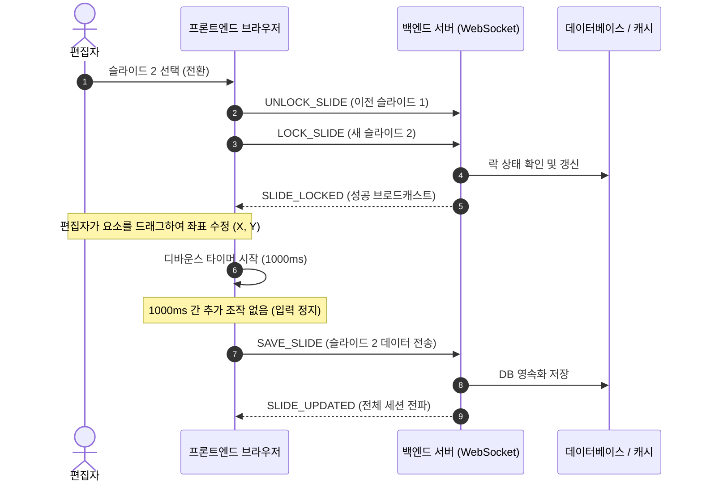
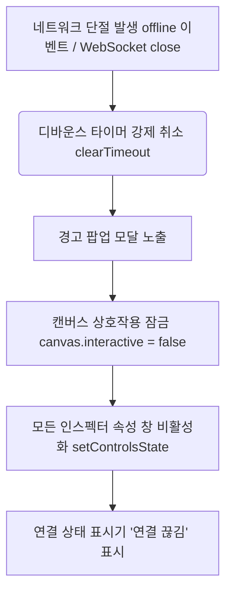

# 슬라이드 자동 저장 및 비관적 락(Pessimistic Lock) 연동 개발 계획서 (v1.1)

본 계획서는 개별 저장 방식의 번거로움을 해결하고 다중 사용자 간 데이터 무결성을 보장하기 위한 **디바운스 자동 저장(Debounced Auto-save)** 및 **비관적 락(Pessimistic Lock)** 연동 개발 명세입니다. 

사용자의 피드백을 반영하여 **디바운스 지연 시간을 1000ms로 확정**하고, **네트워크 단절(Offline) 감지 시 편집 차단 및 알림 팝업 작동 흐름**을 추가 설계하였습니다.

---

## 1. 🏗 아키텍처 개요 및 데이터 흐름

구현의 핵심은 **"내가 락을 소유한 슬라이드에 한해서만, 편집이 멈춘 임계 시점(1000ms)에 변경분을 백엔드로 자동 전송하며, 네트워크가 단절되면 즉시 편집을 멈추고 데이터를 보호한다"**는 것입니다.

### 락 획득 및 자동 저장 시퀀스


---

## 2. 📝 세부 개발 테스크 (Task Breakdown)

### Task 1: 슬라이드 전환 시 락 핸드셰이크 (Lock Handshake)
사용자가 슬라이드를 탐색하거나 바꿀 때, 기존 점유를 풀고 새 점유를 요청하는 파이프라인을 구축합니다.

1. **이전 슬라이드 락 해제**: 
   - 슬라이드가 전환되기 직전, 백엔드로 `UNLOCK_SLIDE` 패킷을 전송합니다.
   ```json
   { "type": "UNLOCK_SLIDE", "slideId": "이전_슬라이드_ID" }
   ```
2. **신규 슬라이드 락 요청**: 
   - `loadSlideToCanvas` 실행 완료 후, 백엔드로 `LOCK_SLIDE` 패킷을 발송합니다.
   ```json
   { "type": "LOCK_SLIDE", "slideId": "새_슬라이드_ID", "editorName": "내_이름" }
   ```

---

### Task 2: 디바운싱 기반 자동 저장 엔진 (Debounced Auto-save Engine)
네트워크 트래픽 비대화를 방지하고 최신 캔버스 데이터만 효율적으로 수집하여 서버로 전송합니다.

1. **디바운스 함수 구현**:
   - 편집 이벤트가 발생할 때마다 타이머를 리셋하고 재부팅시킵니다.
   - 수학적 시간 지연 모델:
     $$\text{실제 저장 실행 시점} = T_{\text{last\_edit}} + \Delta t \quad (\Delta t = 1000\text{ms})$$
2. **저장 전합성(Pre-flight) 체크**:
   - 디바운스 타이머가 만료되어 저장이 실행되는 순간, 다음 조건을 확인합니다:
     ```javascript
     const isMyLock = lockedSlides[activeSlideId]?.ownerId === myEditorId;
     const isOnline = navigator.onLine; // 네트워크 상태 검사
     if (isMyLock && isDirty && isOnline) {
         sendSaveSlidePacket();
     }
     ```
3. **`SAVE_SLIDE` 패킷 발송**:
   - 현재 캔버스 상의 모든 요소를 직렬화하여 서버에 전송합니다.

---

### Task 3: UX/UI 개편 및 저장 상태 표시기 (Save Status Indicator)
기존의 '수동 저장/취소' 버튼을 걷어내고, 사용자에게 신뢰감을 주는 자동 저장 진행 상황 UI를 구축합니다.

1. **상단 바 자동 저장 배너 추가**:
   - `Save` 버튼을 없애고, 우측 상단에 구름 모양 아이콘과 함께 상태 메시지 영역을 만듭니다.
     - 🔄 **저장 중...** (디바운스 타이머가 실행 중이거나 소켓 전송 중일 때)
     - ☁️ **드라이브에 저장됨** (서버로부터 `SLIDE_UPDATED` 수신 완료 시)
2. **비권한자(락 획득 실패자) 편집 제한**:
   - 타인이 락을 쥐고 있는 경우(`LOCK_FAILED` 또는 `SLIDE_LOCKED`로 타인이 소유주일 때), 캔버스를 `interactive = false` 상태로 잠그고 인스펙터 입력을 차단합니다.

---

## 🚨 3. 네트워크 단절(Offline) 대응 예외 처리 설계

네트워크 불안정으로 인한 데이터 유실을 방지하고 사용자에게 시각적으로 통제 상황을 전달하기 위해 아래 **차단 루틴**을 설계합니다.



### 상세 예외 처리 로직
1. **오프라인 상태 감지 트리거**:
   - 브라우저 표준 이벤트(`window.addEventListener('offline', ... )`) 및 WebSocket 연결 종료 이벤트(`ws.onclose`)를 가로칩니다.
2. **타이머 메모리 해제**:
   - 메모리에 대기 중인 디바운스 자동 저장 함수(`autoSaveTimeoutId`)를 `clearTimeout`하여 서버 전송 시도를 차단합니다.
3. **사용자 경고 모달 노출**:
   - 상단 배너 혹은 전면 차단 모달을 띄워 사용자에게 통보합니다:
     > ⚠️ **네트워크 연결이 끊겼습니다.**
     > 변경 사항 유실을 방지하기 위해 편집이 일시 정지됩니다. 연결이 복구되면 자동으로 작업을 재개할 수 있습니다.
4. **강제 쓰기 제한(Write Blocker)**:
   - 캔버스 객체의 선택 속성을 잠급니다.
     ```javascript
     canvas.forEachObject(obj => {
         obj.selectable = false;
         obj.evented = false;
     });
     canvas.discardActiveObject().requestRenderAll();
     ```
   - 속성 편집창의 인풋들을 전부 비활성화시킵니다(`setControlsState(false)`).
5. **네트워크 복구 시 (Re-connection)**:
   - 인터넷 연결 감지(`window.addEventListener('online', ... )`) 시 즉시 WebSocket 재연결을 시도합니다.
   - 소켓 연결 성공 시 활성화된 슬라이드에 대해 `LOCK_SLIDE` 요청을 재전송하고, 락 확보 시 캔버스와 인스펙터의 편집 차단을 해제(`setControlsState(true)`)하여 원활한 작업 복귀를 지원합니다.
