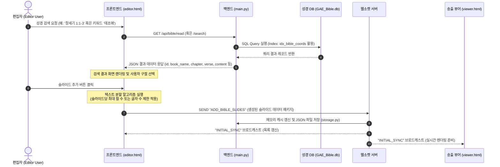

# 교회 방송용 성경 구절 검색 및 슬라이드 연동 기능 설계계획서
**Church Bible Search & Slide Integration Specification**

본 문서는 Subcast 자막 송출 시스템에 교회 예배 및 방송용 성경 구절 검색 기능을 추가하고, 이를 일정한 디자인 템플릿의 슬라이드로 원클릭 추가하기 위한 상세 기획 및 설계 사양서입니다. 본 계획서는 개발자가 즉시 구현에 착수할 수 있도록 데이터베이스 연동, API 설계, UI/UX 구성, 텍스트 자동 분할 알고리즘 및 웹소켓 연동 규격을 상세하게 정의합니다.

---

## 1. 개요 및 요구사항 (Overview & Requirements)

### 1.1 배경 및 목적
* **배경**: 교회 예배 및 기독교 방송 송출 시, 성경 구절 자막은 실시간으로 매우 빈번하게 사용되는 요소입니다.
* **문제점**: 기존 슬라이드 편집기에서 성경 구절을 일일이 복사하여 붙여넣고 서식을 지정하는 방식은 오탈자가 발생하기 쉬우며, 신속한 자막 송출에 한계가 있습니다.
* **목적**: 기 구축된 개역개정 성경 SQLite 데이터베이스(`GAE_Bible.db`)를 시스템에 직접 연동하고, 사용자가 최소한의 조작만으로 검증된 성경 구절을 표준 자막 템플릿으로 변환하여 실시간 슬라이드 목록에 추가할 수 있도록 지원합니다.

### 1.2 핵심 요구사항
1. **성경 구절 다중 검색 모델**:
   * **장/절 탐색(Coordinates Search)**: 성경 권(Book), 장(Chapter), 시작 절(Start Verse) ~ 종료 절(End Verse)의 좌표 기반 탐색.
   * **본문 키워드 검색(Keyword Search)**: 특정 단어가 포함된 성경 구절을 성경 전체에서 찾아내는 텍스트 검색.
2. **표준 자막 템플릿 자동 적용**:
   * `image.png` 레이아웃 사양을 분석하여, 사용자의 수정 없이도 즉시 방송에 적합한 서식(상단: 약어 및 장/절 정보, 하단: 본문 텍스트)으로 가독성 높게 자동 배치되어야 함.
3. **가독성 최적화 및 자동 줄바꿈 (Auto-Pagination & Formatting)**:
   * 화면 크기 대비 성경 본문 텍스트가 너무 길거나 여러 구절이 선택된 경우, 화면 밖으로 글자가 넘치지 않도록 적절한 너비와 폰트 크기를 유지하며, 지정한 기준에 따라 슬라이드를 자동으로 분할(Pagination)하여 생성해야 함.
4. **실시간 peer 동기화 및 락(Lock) 메커니즘**:
   * 생성된 성경 슬라이드는 기존 슬라이드 목록에 즉시 추가되며, 웹소켓(`WebSocket`) 프로토콜을 통해 제어기(Presenter) 및 송출 뷰어(Viewer)에 즉각 반영되어야 함.

---

## 2. 시스템 아키텍처 및 데이터 흐름 (Architecture & Data Flow)

성경 구절 검색 및 슬라이드 추가 시 데이터 흐름은 다음과 같습니다:



---

## 3. 데이터베이스 연동 명세 (Database Integration)

### 3.1 테이블 스키마 구조
기 구축된 `GAE_Bible.db`의 `bible` 테이블 및 복합 인덱스(`idx_bible_coords`) 정보를 기반으로 질의를 수행합니다.

* **테이블명**: `bible`
* **컬럼 상세**:
  * `id` (`INTEGER`): 기본키 (PK)
  * `book_code` (`TEXT`): 영문 공식 약어 (예: `gen`, `exo`, `isa` 등)
  * `book_name` (`TEXT`): 한글 명칭 (예: `창세기`, `출애굽기`, `이사야` 등)
  * `chapter` (`INTEGER`): 장 번호
  * `verse` (`INTEGER`): 절 번호
  * `content` (`TEXT`): 정제된 본문 텍스트
  * `title` (`TEXT`): 소제목 (존재할 경우)

### 3.2 SQL 질의 최적화 패턴
1. **장/절 범위 조회 (좌표 검색)**:
   * 복합 인덱스 `idx_bible_coords(book_code, chapter, verse)`를 온전히 활용하여 $\mathcal{O}(\log N)$ 복잡도로 데이터를 조회합니다.
   ```sql
   SELECT book_name, book_code, chapter, verse, content 
   FROM bible 
   WHERE book_code = :book_code AND chapter = :chapter AND verse BETWEEN :start_verse AND :end_verse
   ORDER BY verse ASC;
   ```

2. **키워드 본문 검색**:
   * 본문 검색은 부분 일치 질의(`LIKE`)를 통해 탐색하며, 검색된 결과는 순차 정렬하여 반환합니다.
   ```sql
   SELECT book_name, book_code, chapter, verse, content 
   FROM bible 
   WHERE content LIKE :keyword
   ORDER BY id ASC
   LIMIT :limit;
   ```

---

## 4. 백엔드 API 명세 (Backend API Specifications)

FastAPI(`backend/main.py`)에 신규로 추가할 REST API 엔드포인트 명세입니다.

### 4.1 `GET /api/bible/books`
성경 66권 전체 목록과 각 권의 한글 명칭, 영문 약칭, 신/구약 구분 및 최대 장 수 정보를 반환합니다. 프론트엔드의 성경 권/장 선택 드롭다운 UI 구성에 사용됩니다.

* **Request**:
  * Method: `GET`
  * Path: `/api/bible/books`
* **Response (JSON)**:
  ```json
  [
    {
      "book_code": "gen",
      "book_name": "창세기",
      "testament": "OT",
      "max_chapter": 50
    },
    {
      "book_code": "rev",
      "book_name": "요한계시록",
      "testament": "NT",
      "max_chapter": 22
    }
  ]
  ```

### 4.2 `GET /api/bible/read`
특정 책의 특정 장 및 절 범위에 해당하는 구절 목록을 정밀 조회합니다.

* **Request**:
  * Method: `GET`
  * Path: `/api/bible/read`
  * Query Parameters:
    * `book_code` (string, 필수): 영문 약칭 (예: `isa`)
    * `chapter` (integer, 필수): 장 번호 (예: `1`)
    * `start_verse` (integer, 선택, 기본값 `1`): 시작 절
    * `end_verse` (integer, 선택, 기본값 `999`): 종료 절 (지정하지 않거나 큰 수일 시 해당 장 전체 조회)
* **Response (JSON)**:
  ```json
  {
    "book_name": "이사야",
    "book_code": "isa",
    "chapter": 1,
    "verses": [
      {
        "verse": 29,
        "content": "너희가 기뻐하던 상수리나무로 말미암아 너희가 부끄러움을 당할 것이요 너희가 택한 동산으로 말미암아 수치를 당할 것이며"
      }
    ]
  }
  ```

### 4.3 `GET /api/bible/search`
키워드를 기반으로 성경 전체에서 일치하는 구절 목록을 검색합니다.

* **Request**:
  * Method: `GET`
  * Path: `/api/bible/search`
  * Query Parameters:
    * `query` (string, 필수): 검색할 텍스트 키워드 (공백 제거 후 2자 이상 제한)
    * `limit` (integer, 선택, 기본값 `50`): 최대 반환 레코드 수
* **Response (JSON)**:
  ```json
  {
    "query": "태초에",
    "total_results": 2,
    "results": [
      {
        "book_name": "창세기",
        "book_code": "gen",
        "chapter": 1,
        "verse": 1,
        "content": "태초에 하나님이 천지를 창조하시니라"
      },
      {
        "book_name": "요한복음",
        "book_code": "jhn",
        "chapter": 1,
        "verse": 1,
        "content": "태초에 말씀이 계시니라 이 말씀이 하나님과 함께 계셨으니 이 말씀은 곧 하나님이시니라"
      }
    ]
  }
  ```

---

## 5. 프론트엔드 UI/UX 설계 (Frontend UI/UX Design)

프론트엔드 편집기(`editor.html`)의 좌측 탭 메뉴에 "성경" 탭을 추가하고 하위 인터페이스를 레이아웃합니다.

### 5.1 드로어 패널 구조 (`panel-bible`)
기존 `.left-sub-panel` 내부에 신규 사이드바 패널을 선언합니다.

```html
<!-- 성경 탭 패널 -->
<div class="sidebar-panel" id="panel-bible">
    <div class="panel-header">
        <h3>성경 구절 검색</h3>
    </div>
    <div class="panel-body" style="display: flex; flex-direction: column; overflow: hidden; gap: 12px;">
        <!-- 검색 모드 선택 (세그먼트 탭) -->
        <div class="search-mode-tabs" style="display: flex; background: rgba(255,255,255,0.05); border-radius: var(--radius-sm); padding: 2px;">
            <button class="mode-tab-btn active" id="btn-mode-coord" style="flex: 1; text-align: center; padding: 6px; font-size: 0.75rem; border: none; background: transparent; color: var(--text-muted); cursor: pointer;">장/절 검색</button>
            <button class="mode-tab-btn" id="btn-mode-keyword" style="flex: 1; text-align: center; padding: 6px; font-size: 0.75rem; border: none; background: transparent; color: var(--text-muted); cursor: pointer;">키워드 검색</button>
        </div>

        <!-- 1) 장/절 검색 폼 -->
        <div id="form-coord-search" style="display: flex; flex-direction: column; gap: 8px;">
            <div style="display: flex; gap: 6px;">
                <select id="select-bible-book" style="flex: 2; padding: 6px; background: var(--bg-dark); border: 1px solid var(--panel-border); color: var(--text-main); border-radius: var(--radius-sm); font-size: 0.8rem;"></select>
                <input type="number" id="input-bible-chapter" placeholder="장" min="1" style="flex: 1; width: 50px; padding: 6px; background: var(--bg-dark); border: 1px solid var(--panel-border); color: var(--text-main); border-radius: var(--radius-sm); font-size: 0.8rem; text-align: center;">
            </div>
            <div style="display: flex; align-items: center; gap: 6px;">
                <input type="number" id="input-bible-start-verse" placeholder="시작 절" min="1" style="flex: 1; padding: 6px; background: var(--bg-dark); border: 1px solid var(--panel-border); color: var(--text-main); border-radius: var(--radius-sm); font-size: 0.8rem; text-align: center;">
                <span style="color: var(--text-muted);">~</span>
                <input type="number" id="input-bible-end-verse" placeholder="끝 절" min="1" style="flex: 1; padding: 6px; background: var(--bg-dark); border: 1px solid var(--panel-border); color: var(--text-main); border-radius: var(--radius-sm); font-size: 0.8rem; text-align: center;">
            </div>
            <button class="btn-template-action" id="btn-bible-fetch" style="background: var(--primary); border: none; width: 100%;">구절 가져오기</button>
        </div>

        <!-- 2) 키워드 검색 폼 -->
        <div id="form-keyword-search" style="display: none; flex-direction: column; gap: 8px;">
            <div style="display: flex; gap: 6px;">
                <input type="text" id="input-bible-keyword" placeholder="검색할 키워드 입력 (예: 태초에)" style="flex: 1; padding: 6px; background: var(--bg-dark); border: 1px solid var(--panel-border); color: var(--text-main); border-radius: var(--radius-sm); font-size: 0.8rem;">
                <button class="btn-template-action" id="btn-bible-search" style="background: var(--primary); border: none; width: auto; padding: 6px 12px; margin-top: 0;">검색</button>
            </div>
        </div>

        <!-- 결과 리스트 헤더 & 옵션 -->
        <div style="display: flex; justify-content: space-between; align-items: center; border-top: 1px solid var(--panel-border); padding-top: 8px; flex-shrink: 0;">
            <label style="font-size: 0.72rem; color: var(--text-muted); font-weight: 600;">검색 결과</label>
            <div style="display: flex; align-items: center; gap: 4px;">
                <input type="checkbox" id="chk-select-all-bible" style="cursor: pointer;">
                <span style="font-size: 0.72rem; color: var(--text-muted); cursor: pointer;" id="lbl-select-all-bible">전체 선택</span>
            </div>
        </div>

        <!-- 검색 결과 리스트 컨테이너 -->
        <div id="bible-results-list" style="flex: 1; overflow-y: auto; display: flex; flex-direction: column; gap: 6px; padding-right: 4px; min-height: 150px; border: 1px solid var(--panel-border); border-radius: var(--radius-sm); padding: 6px; background: rgba(0,0,0,0.2);">
            <!-- 검색 결과 아이템들이 동적 렌더링됨 -->
            <div style="color: var(--text-muted); font-size: 0.78rem; text-align: center; margin: auto;">검색어를 입력하고 조회하세요.</div>
        </div>

        <!-- 슬라이드 생성 및 옵션 제어 패널 -->
        <div class="bible-generation-options" style="border-top: 1px solid var(--panel-border); padding-top: 8px; display: flex; flex-direction: column; gap: 8px; flex-shrink: 0;">
            <div style="display: flex; align-items: center; justify-content: space-between;">
                <span style="font-size: 0.75rem; color: var(--text-main);">슬라이드당 절 수</span>
                <select id="select-bible-split-mode" style="padding: 4px 8px; background: var(--bg-dark); border: 1px solid var(--panel-border); color: var(--text-main); border-radius: var(--radius-sm); font-size: 0.75rem;">
                    <option value="1">1절씩 분할</option>
                    <option value="2">2절씩 묶기</option>
                    <option value="all">선택 구절 전체 합쳐서 1장</option>
                    <option value="auto">글자 수 기준 자동 분할</option>
                </select>
            </div>
            <button class="btn-template-action" id="btn-add-bible-slides" style="background: #10b981; border: none; margin-top: 4px; display: flex; align-items: center; justify-content: center; gap: 6px;" disabled>
                <span>➕ 선택 구절 슬라이드 추가</span>
            </button>
        </div>
    </div>
</div>
```

---

## 6. 성경 자막 송출 템플릿 표준 규격 (`image.png` 기반)

사용자가 일일이 스타일을 손보지 않아도 즉시 고급 자막 방송이 가능하도록, `image.png` 레이아웃을 정밀 계측하여 다음과 같은 템플릿 표준 사양을 적용합니다.

### 6.1 디자인 시스템 및 스타일 가이드 (Design Tokens)

* **배경 사양**: 검정색 단색 배경 (`#000000`) 또는 크로마키 투명 (`transparent`).
* **폰트 패밀리**: 
  * 한글 가독성이 우수한 고딕 계열 시스템 폰트 및 Google Fonts 연동.
  * 기본값: `Pretendard`, `NanumSquareNeo`, `Inter`, `sans-serif`
* **자체 캔버스 해상도 기준**: 가로 $1920\text{px}$, 세로 $1080\text{px}$ (기준 비율 $16:9$).
  * 뷰포트 내 요소 크기는 화면 해상도 변화에 선형적으로 대응할 수 있도록 `vw` 및 백분율(%) 단위를 사용하여 제어합니다.

### 6.2 슬라이드 레이아웃 명세
하나의 슬라이드에 추가되는 성경 자막은 **[장/절 메타데이터 텍스트]**와 **[본문 텍스트]**의 2개 그룹화된 텍스트 객체로 구성됩니다.

```
+--------------------------------------------------------------+
|  (X: 7.2%, Y: 14.8%)                                         |
|  [사 1:29]  <-- FontSize: 2.2vw, FontWeight: 600, LineHeight: 1.2|
|                                                              |
|  [너희가 기뻐하던 상수리나무로 말미암아                      |
|   너희가 부끄러움을 당할 것이요 너희가 택한                  |
|   동산으로 말미암아 수치를 당할 것이며]                      |
|             <-- FontSize: 3.8vw, FontWeight: 700, LineHeight: 1.5|
|                                                              |
|                                                              |
|                                                              |
|                                                              |
+--------------------------------------------------------------+
```

1. **장/절 표시 요소 (Header Text Element)**:
   * **텍스트 내용**: 책 약어 + 장/절 (예: `사 1:29`, `창 1:1-3`)
   * **좌표**: `x: 7.2` (가로 기준 $7.2\%$), `y: 14.8` (세로 기준 $14.8\%$)
   * **너비/높이**: `width: 85.0`, `height: 5.0`
   * **스타일**:
     * `fontSize`: `2.2vw` (약 $42\text{px}$ 상당)
     * `fontColor`: `#ffffff`
     * `fontWeight`: `600` (Semi-Bold)
     * `textAlign`: `left`

2. **본문 표시 요소 (Content Text Element)**:
   * **텍스트 내용**: 성경 구절 본문 (줄바꿈이 적용된 텍스트)
   * **좌표**: `x: 7.2` (가로 기준 $7.2\%$), `y: 22.5` (세로 기준 $22.5\%$, 장/절 요소에서 약 $8.0\%$ 하단 배치)
   * **너비/높이**: `width: 85.6`, `height: 60.0`
   * **스타일**:
     * `fontSize`: `3.8vw` (약 $73\text{px}$ 상당)
     * `fontColor`: `#ffffff`
     * `fontWeight`: `700` (Bold)
     * `textAlign`: `left`
     * `extra`: `{"lineHeight": 1.45, "charSpacing": -10}` (가독성을 위한 행간 및 자간 조절)

---

## 7. 슬라이드 자동 생성 및 분할 알고리즘 (Auto-Pagination & Formatting)

여러 구절을 한꺼번에 선택하거나 본문 텍스트가 매우 길 경우, 가독성이 해쳐지지 않도록 자동으로 슬라이드를 생성 및 분할하는 알고리즘을 프론트엔드 비즈니스 로직에 포함합니다.

### 7.1 분할 처리 모드 (Split Modes)

1. **1절씩 분할 (One Verse per Slide - 권장)**:
   * 선택된 구절 목록을 1개의 절 단위로 쪼개어 각각 독립된 슬라이드로 생성합니다.
   * *장/절 표시*: `사 1:29`, `사 1:30` 등 단일 절 표기.
2. **N절씩 묶기 (N Verses per Slide)**:
   * 사용자가 지정한 $N$개의 절을 하나의 슬라이드 본문에 합쳐서 생성합니다.
   * *장/절 표시*: `사 1:29-30` (범위 결합 표기).
3. **글자 수 기준 자동 분할 (Character Limit Auto-Split)**:
   * 하나의 절이라도 본문 글자 수가 임계값 $C_{max}$ (예: 공백 포함 80자)를 초과할 경우, 이를 두 개 이상의 슬라이드로 자동 분산합니다.
   * *분할 처리 로직*:
     * 본문 텍스트를 공백 또는 마침표 기준으로 단어 단위 분할.
     * 한 슬라이드당 글자 수가 $C_{max}$를 넘지 않도록 가용한 행(Line)으로 재조합.
     * 분할된 슬라이드의 장/절 표시는 일관되게 `사 1:29 (1)`, `사 1:29 (2)` 또는 `사 1:29`로 표기 (사용자 설정에 따름).

### 7.2 책 공식 명칭의 방송용 약어 변환 규칙
성경의 정식 한글 명칭(예: `창세기`)을 화면 노출에 최적화된 표준 약어(예: `창`)로 실시간 치환하여 장/절 표시 요소의 텍스트 길이를 단축합니다.

| 정식 명칭 | 방송용 약어 (Code) | 정식 명칭 | 방송용 약어 (Code) |
| :--- | :--- | :--- | :--- |
| 창세기 | 창 (gen) | 이사야 | 사 (isa) |
| 출애굽기 | 출 (exo) | 예레미야 | 렘 (jer) |
| 레위기 | 레 (lev) | 예레미야애가 | 애 (lam) |
| 민수기 | 민 (num) | 에스겔 | 겔 (ezk) |
| 신명기 | 신 (deu) | 다니엘 | 단 (dan) |
| 여호수아 | 수 (jos) | 호세아 | 호 (hos) |
| 사사기 | 사 (jdg) | 요엘 | 욜 (jol) |
| 룻기 | 룻 (rut) | 아모스 | 암 (amo) |
| 사무엘상 | 삼상 (1sa) | 오바댜 | 옵 (oba) |
| 사무엘하 | 삼하 (2sa) | 요나 | 욘 (jnh) |
| 열왕기상 | 왕상 (1ki) | 미가 | 미 (mic) |
| 열왕기하 | 왕하 (2ki) | 나훔 | 나 (nam) |
| 역대상 | 대상 (1ch) | 하박국 | 합 (hab) |
| 역대하 | 대하 (2ch) | 스바냐 | 습 (zep) |
| 에스라 | 람 (ezr) / 에스라(습) | 학개 | 학 (hag) |
| 느헤미야 | 느 (neh) | 스가랴 | 슥 (zec) |
| 에스더 | 에 (est) | 말라기 | 말 (mal) |
| 욥기 | 욥 (job) | 마태복음 | 마 (mat) |
| 시편 | 시 (psa) | 마가복음 | 막 (mrk) |
| 잠언 | 잠 (pro) | 누가복음 | 눅 (luk) |
| 전도서 | 전 (ecc) | 요한복음 | 요 (jhn) |
| 아가 | 아 (sng) | 사도행전 | 행 (act) |
| 로마서 | 롬 (rom) | 데살로니가후서 | 살후 (2th) |
| 고린도전서 | 고전 (1co) | 디모데전서 | 딤전 (1ti) |
| 고린도후서 | 고후 (2co) | 디모데후서 | 딤후 (2ti) |
| 갈라디아서 | 갈 (gal) | 디도서 | 딛 (tit) |
| 에베소서 | 엡 (eph) | 빌레몬서 | 몬 (phm) |
| 빌립보서 | 빌 (php) | 히브리서 | 히 (heb) |
| 골로새서 | 골 (col) | 야고보서 | 약 (jas) |
| 데살로니가전서 | 살전 (1th) | 베드로전서 | 벧전 (1pe) |
| 베드로후서 | 벧후 (2pe) | 요한1서 | 요일 (1jn) |
| 요한2서 | 요이 (2jn) | 요한3서 | 요삼 (3jn) |
| 유다서 | 유 (jud) | 요한계시록 | 계 (rev) |

---

## 8. 웹소켓 프로토콜 설계 (WebSocket Protocol)

새로 도입될 슬라이드 생성 작업은 프론트엔드에서 완성된 `Slide` 객체의 리스트를 만들어 백엔드로 일괄 전송함으로써, 서버 캐시 갱신 및 파일 저장 프로세스를 일괄 처리합니다.

### 8.1 클라이언트 전송 이벤트: `ADD_SLIDES_BULK`
프론트엔드에서 성경 템플릿 형태로 인스턴스화한 슬라이드 배열을 웹소켓을 통해 서버로 전송합니다.

* **Payload 사양**:
  ```json
  {
    "type": "ADD_SLIDES_BULK",
    "slides": [
      {
        "id": "slide_bible_01a2b3",
        "name": "성경: 사 1:29",
        "elements": [
          {
            "id": "elem_bible_h_01a",
            "type": "text",
            "content": "사 1:29",
            "x": 7.2,
            "y": 14.8,
            "width": 85.0,
            "height": 5.0,
            "style": {
              "fontSize": "2.2vw",
              "fontColor": "#ffffff",
              "fontFamily": "Inter",
              "fontWeight": "600",
              "textAlign": "left"
            }
          },
          {
            "id": "elem_bible_c_01b",
            "type": "text",
            "content": "너희가 기뻐하던 상수리나무로 말미암아\n너희가 부끄러움을 당할 것이요 너희가 택한\n동산으로 말미암아 수치를 당할 것이며",
            "x": 7.2,
            "y": 22.5,
            "width": 85.6,
            "height": 60.0,
            "style": {
              "fontSize": "3.8vw",
              "fontColor": "#ffffff",
              "fontFamily": "Inter",
              "fontWeight": "700",
              "textAlign": "left"
            }
          }
        ]
      }
    ]
  }
  ```

### 8.2 서버 브로드캐스트 이벤트: `INITIAL_SYNC`
서버는 수신된 벌크 데이터를 기존 프로젝트의 `slides` 배열에 추가한 뒤, 파일로 디스크에 커밋합니다. 이후 전체 피어에게 변경 상태를 브로드캐스트하여 프론트엔드의 상태를 자동 갱신시킵니다.
*(기존 `main.py`에 정의된 `INITIAL_SYNC` 수신 로직을 그대로 활용하여 프론트엔드 뷰에 자동 반영시킵니다.)*

---

## 9. 테스트 및 품질 검증 방안 (Testing & Quality Assurance)

1. **데이터베이스 쿼리 속도**:
   * 성경 구절 탐색 쿼리 실행 시간이 $10\text{ms}$ 이하인지 프로파일링 도구를 사용하여 모니터링합니다.
   * `idx_bible_coords` 인덱스가 `EXPLAIN QUERY PLAN` 상에서 `SEARCH TABLE`로 정상 작동하는지 검증합니다.
2. **줄바꿈 및 분할 정밀도**:
   * 본문 글자 수 100자 이상의 초장문 구절(예: 시편 119편 일부 구절)이 들어갔을 때, 텍스트 분할 알고리즘이 임계 너비를 벗어나지 않고 슬라이드를 정상 분할 생성하는지 확인합니다.
3. **해상도 호환성**:
   * $1920\times1080$(FHD) 디스플레이 기준 렌더링된 요소들이 뷰어 줌 스케일링 함수(`setZoom`)를 통해 4K 해상도 및 모바일/태블릿 화면 크기에서도 오차 없이 $16:9$ 비율의 동일한 좌표계에 정렬되는지 시각적 왜곡 테스트를 거칩니다.

---

## 10. 참고 자료 (Key References)
* [SQLite 공식 문서 - Query Planning 및 Indexing](https://www.sqlite.org/queryplanner.html)
* [Fabric.js 공식 API 가이드 - Text & IText 클래스 제어](http://fabricjs.com/docs/fabric.Text.html)
* [FastAPI 공식 가이드 - WebSocket & APIRouter 연동](https://fastapi.tiangolo.com/advanced/websockets/)
