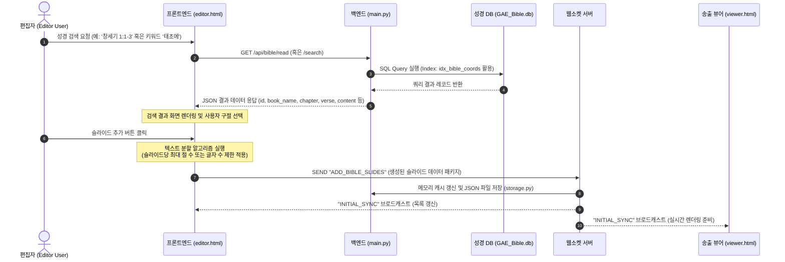

# 교회 방송용 성경 구절 검색 및 슬라이드 연동 기능 설계계획서
**Church Bible Search & Slide Integration Specification**

본 문서는 Subcast 자막 송출 시스템에 교회 예배 및 방송용 성경 구절 검색 기능을 추가하고, 이를 일정한 디자인 템플릿의 슬라이드로 원클릭 추가하기 위한 상세 기획 및 설계 사양서입니다. 본 계획서는 개발자가 즉시 구현에 착수할 수 있도록 데이터베이스 연동, API 설계, UI/UX 구성, 텍스트 자동 분할 알고리즘 및 웹소켓 연동 규격을 상세하게 정의합니다.

---

## 1. 개요 및 요구사항 (Overview & Requirements)

### 1.1 배경 및 목적
* **배경**: 교회 예배 및 기독교 방송 송출 시, 성경 구절 자막은 실시간으로 매우 빈번하게 사용되는 요소입니다.
* **문제점**: 기존 슬라이드 편집기에서 성경 구절을 일일이 복사하여 붙여넣고 서식을 지정하는 방식은 오탈자가 발생하기 쉬우며, 신속한 자막 송출에 한계가 있습니다.
* **목적**: 기 구축된 개역개정 성경 SQLite 데이터베이스(`GAE_Bible.db`)를 시스템에 직접 연동하고, 사용자가 최소한의 조작만으로 검증된 성경 구절을 표준 자막 템플릿으로 변환하여 실시간 슬라이드 목록에 추가할 수 있도록 지원합니다.

### 1.2 핵심 요구사항
1. **성경 구절 다중 검색 모델**:
   * **장/절 탐색(Coordinates Search)**: 성경 권(Book), 장(Chapter), 시작 절(Start Verse) ~ 종료 절(End Verse)의 좌표 기반 탐색.
   * **본문 키워드 검색(Keyword Search)**: 특정 단어가 포함된 성경 구절을 성경 전체에서 찾아내는 텍스트 검색.
2. **표준 자막 템플릿 자동 적용**:
   * `image.png` 레이아웃 사양을 분석하여, 사용자의 수정 없이도 즉시 방송에 적합한 서식(상단: 약어 및 장/절 정보, 하단: 본문 텍스트)으로 가독성 높게 자동 배치되어야 함.
3. **가독성 최적화 및 자동 줄바꿈 (Auto-Pagination & Formatting)**:
   * 화면 크기 대비 성경 본문 텍스트가 너무 길거나 여러 구절이 선택된 경우, 화면 밖으로 글자가 넘치지 않도록 적절한 너비와 폰트 크기를 유지하며, 지정한 기준에 따라 슬라이드를 자동으로 분할(Pagination)하여 생성해야 함.
4. **실시간 peer 동기화 및 락(Lock) 메커니즘**:
   * 생성된 성경 슬라이드는 기존 슬라이드 목록에 즉시 추가되며, 웹소켓(`WebSocket`) 프로토콜을 통해 제어기(Presenter) 및 송출 뷰어(Viewer)에 즉각 반영되어야 함.

---

## 2. 시스템 아키텍처 및 데이터 흐름 (Architecture & Data Flow)

성경 구절 검색 및 슬라이드 추가 시 데이터 흐름은 다음과 같습니다:



---

## 3. 데이터베이스 연동 명세 (Database Integration)

### 3.1 테이블 스키마 구조
기 구축된 `GAE_Bible.db`의 `bible` 테이블 및 복합 인덱스(`idx_bible_coords`) 정보를 기반으로 질의를 수행합니다.

* **테이블명**: `bible`
* **컬럼 상세**:
  * `id` (`INTEGER`): 기본키 (PK)
  * `book_code` (`TEXT`): 영문 공식 약어 (예: `gen`, `exo`, `isa` 등)
  * `book_name` (`TEXT`): 한글 명칭 (예: `창세기`, `출애굽기`, `이사야` 등)
  * `chapter` (`INTEGER`): 장 번호
  * `verse` (`INTEGER`): 절 번호
  * `content` (`TEXT`): 정제된 본문 텍스트
  * `title` (`TEXT`): 소제목 (존재할 경우)

### 3.2 SQL 질의 최적화 패턴
1. **장/절 범위 조회 (좌표 검색)**:
   * 복합 인덱스 `idx_bible_coords(book_code, chapter, verse)`를 온전히 활용하여 $\mathcal{O}(\log N)$ 복잡도로 데이터를 조회합니다.
   ```sql
   SELECT book_name, book_code, chapter, verse, content 
   FROM bible 
   WHERE book_code = :book_code AND chapter = :chapter AND verse BETWEEN :start_verse AND :end_verse
   ORDER BY verse ASC;
   ```

2. **키워드 본문 검색**:
   * 본문 검색은 부분 일치 질의(`LIKE`)를 통해 탐색하며, 검색된 결과는 순차 정렬하여 반환합니다.
   ```sql
   SELECT book_name, book_code, chapter, verse, content 
   FROM bible 
   WHERE content LIKE :keyword
   ORDER BY id ASC
   LIMIT :limit;
   ```

---

## 4. 백엔드 API 명세 (Backend API Specifications)

FastAPI(`backend/main.py`)에 신규로 추가할 REST API 엔드포인트 명세입니다.

### 4.1 `GET /api/bible/books`
성경 66권 전체 목록과 각 권의 한글 명칭, 영문 약칭, 신/구약 구분 및 최대 장 수 정보를 반환합니다. 프론트엔드의 성경 권/장 선택 드롭다운 UI 구성에 사용됩니다.

* **Request**:
  * Method: `GET`
  * Path: `/api/bible/books`
* **Response (JSON)**:
  ```json
  [
    {
      "book_code": "gen",
      "book_name": "창세기",
      "testament": "OT",
      "max_chapter": 50
    },
    {
      "book_code": "rev",
      "book_name": "요한계시록",
      "testament": "NT",
      "max_chapter": 22
    }
  ]
  ```

### 4.2 `GET /api/bible/read`
특정 책의 특정 장 및 절 범위에 해당하는 구절 목록을 정밀 조회합니다.

* **Request**:
  * Method: `GET`
  * Path: `/api/bible/read`
  * Query Parameters:
    * `book_code` (string, 필수): 영문 약칭 (예: `isa`)
    * `chapter` (integer, 필수): 장 번호 (예: `1`)
    * `start_verse` (integer, 선택, 기본값 `1`): 시작 절
    * `end_verse` (integer, 선택, 기본값 `999`): 종료 절 (지정하지 않거나 큰 수일 시 해당 장 전체 조회)
* **Response (JSON)**:
  ```json
  {
    "book_name": "이사야",
    "book_code": "isa",
    "chapter": 1,
    "verses": [
      {
        "verse": 29,
        "content": "너희가 기뻐하던 상수리나무로 말미암아 너희가 부끄러움을 당할 것이요 너희가 택한 동산으로 말미암아 수치를 당할 것이며"
      }
    ]
  }
  ```

### 4.3 `GET /api/bible/search`
키워드를 기반으로 성경 전체에서 일치하는 구절 목록을 검색합니다.

* **Request**:
  * Method: `GET`
  * Path: `/api/bible/search`
  * Query Parameters:
    * `query` (string, 필수): 검색할 텍스트 키워드 (공백 제거 후 2자 이상 제한)
    * `limit` (integer, 선택, 기본값 `50`): 최대 반환 레코드 수
* **Response (JSON)**:
  ```json
  {
    "query": "태초에",
    "total_results": 2,
    "results": [
      {
        "book_name": "창세기",
        "book_code": "gen",
        "chapter": 1,
        "verse": 1,
        "content": "태초에 하나님이 천지를 창조하시니라"
      },
      {
        "book_name": "요한복음",
        "book_code": "jhn",
        "chapter": 1,
        "verse": 1,
        "content": "태초에 말씀이 계시니라 이 말씀이 하나님과 함께 계셨으니 이 말씀은 곧 하나님이시니라"
      }
    ]
  }
  ```

---

## 5. 프론트엔드 UI/UX 설계 (Frontend UI/UX Design)

프론트엔드 편집기(`editor.html`)의 좌측 내비게이션 탭 메뉴에 "성경" 탭을 추가하고, 드로어 패널의 세부 스타일 및 클라이언트 사이드 인터랙션(Client-side Interaction) 흐름을 다음과 같이 설계합니다.

### 5.1 사이드바 탭 버튼 구성 (`left-nav-sidebar`)
기존 좌측 아이콘 메뉴 바(`left-nav-sidebar`)에 아래와 같이 성경 전용 탭 버튼을 삽입합니다.

```html
<!-- 성경 탭 버튼 (left-nav-sidebar 내부) -->
<button class="nav-tab-btn" data-target="panel-bible" onclick="switchLeftTab('panel-bible')">
    <svg viewBox="0 0 24 24" fill="none" stroke="currentColor" stroke-width="2" stroke-linecap="round" stroke-linejoin="round">
        <!-- 책(Book) 모양의 미니멀 아이콘 리소스 -->
        <path d="M4 19.5A2.5 2.5 0 0 1 6.5 17H20"></path>
        <path d="M6.5 2H20v20H6.5A2.5 2.5 0 0 1 4 19.5v-15A2.5 2.5 0 0 1 6.5 2z"></path>
    </svg>
    <span>성경</span>
</button>
```

### 5.2 드로어 패널 상세 마크업 (`panel-bible`)
드로어 패널 내부에서 탭 이동, 유효성 검증 및 옵션 선택이 가능하도록 마크업을 구조화합니다.

```html
<!-- 성경 탭 패널 -->
<div class="sidebar-panel" id="panel-bible">
    <div class="panel-header">
        <h3>성경 구절 검색</h3>
    </div>
    
    <div class="panel-body" style="display: flex; flex-direction: column; overflow: hidden; gap: 14px; height: 100%;">
        <!-- 검색 모드 선택 (Segmented Control) -->
        <div class="search-mode-tabs" style="display: flex; background: var(--bg-dark); border: 1px solid var(--panel-border); border-radius: var(--radius-sm); padding: 2px; flex-shrink: 0;">
            <button class="mode-tab-btn active" id="btn-mode-coord" style="flex: 1; text-align: center; padding: 6px 12px; font-size: 0.78rem; border: none; border-radius: var(--radius-xs); background: transparent; color: var(--text-muted); cursor: pointer; font-weight: 500; transition: all 0.2s ease;">장/절 검색</button>
            <button class="mode-tab-btn" id="btn-mode-keyword" style="flex: 1; text-align: center; padding: 6px 12px; font-size: 0.78rem; border: none; border-radius: var(--radius-xs); background: transparent; color: var(--text-muted); cursor: pointer; font-weight: 500; transition: all 0.2s ease;">본문 키워드 검색</button>
        </div>

        <!-- 1) 장/절 검색 입력 그룹 -->
        <div id="form-coord-search" style="display: flex; flex-direction: column; gap: 8px; flex-shrink: 0;">
            <div style="display: flex; gap: 8px;">
                <div style="display: flex; flex-direction: column; flex: 2; gap: 4px;">
                    <label style="font-size: 0.68rem; color: var(--text-muted); font-weight: 600;">성경 권 선택</label>
                    <select id="select-bible-book" style="width: 100%; padding: 8px; background: var(--bg-dark); border: 1px solid var(--panel-border); color: var(--text-main); border-radius: var(--radius-sm); font-size: 0.8rem; height: 36px;"></select>
                </div>
                <div style="display: flex; flex-direction: column; flex: 1; gap: 4px;">
                    <label style="font-size: 0.68rem; color: var(--text-muted); font-weight: 600;">장 (Chapter)</label>
                    <input type="number" id="input-bible-chapter" placeholder="1" min="1" style="width: 100%; padding: 8px; background: var(--bg-dark); border: 1px solid var(--panel-border); color: var(--text-main); border-radius: var(--radius-sm); font-size: 0.8rem; text-align: center; height: 36px;">
                </div>
            </div>
            <div style="display: flex; align-items: center; gap: 8px;">
                <div style="display: flex; flex-direction: column; flex: 1; gap: 4px;">
                    <label style="font-size: 0.68rem; color: var(--text-muted); font-weight: 600;">시작 절</label>
                    <input type="number" id="input-bible-start-verse" placeholder="1" min="1" style="width: 100%; padding: 8px; background: var(--bg-dark); border: 1px solid var(--panel-border); color: var(--text-main); border-radius: var(--radius-sm); font-size: 0.8rem; text-align: center; height: 36px;">
                </div>
                <span style="color: var(--text-muted); margin-top: 18px; font-weight: 500;">~</span>
                <div style="display: flex; flex-direction: column; flex: 1; gap: 4px;">
                    <label style="font-size: 0.68rem; color: var(--text-muted); font-weight: 600;">끝 절</label>
                    <input type="number" id="input-bible-end-verse" placeholder="1" min="1" style="width: 100%; padding: 8px; background: var(--bg-dark); border: 1px solid var(--panel-border); color: var(--text-main); border-radius: var(--radius-sm); font-size: 0.8rem; text-align: center; height: 36px;">
                </div>
            </div>
            <button class="btn-template-action" id="btn-bible-fetch" style="background: var(--primary); border: none; width: 100%; height: 36px; display: flex; align-items: center; justify-content: center; gap: 6px; font-weight: 600; cursor: pointer; transition: background 0.15s;">
                <span>조회 및 본문 로드</span>
            </button>
        </div>

        <!-- 2) 본문 키워드 검색 입력 그룹 -->
        <div id="form-keyword-search" style="display: none; flex-direction: column; gap: 8px; flex-shrink: 0;">
            <div style="display: flex; flex-direction: column; gap: 4px;">
                <label style="font-size: 0.68rem; color: var(--text-muted); font-weight: 600;">성경 본문 검색</label>
                <div style="display: flex; gap: 8px;">
                    <input type="text" id="input-bible-keyword" placeholder="키워드 입력 (예: 천지, 태초에)" style="flex: 1; padding: 8px; background: var(--bg-dark); border: 1px solid var(--panel-border); color: var(--text-main); border-radius: var(--radius-sm); font-size: 0.8rem; height: 36px;">
                    <button class="btn-template-action" id="btn-bible-search" style="background: var(--primary); border: none; width: auto; padding: 0 16px; margin-top: 0; font-weight: 600; height: 36px; cursor: pointer; transition: background 0.15s;">검색</button>
                </div>
            </div>
        </div>

        <!-- 검색 결과 헤더 영역 -->
        <div style="display: flex; justify-content: space-between; align-items: center; border-top: 1px solid var(--panel-border); padding-top: 10px; flex-shrink: 0;">
            <label id="lbl-result-count" style="font-size: 0.72rem; color: var(--text-muted); font-weight: 600; text-transform: uppercase; letter-spacing: 0.5px;">검색 결과 (0건)</label>
            <div style="display: flex; align-items: center; gap: 6px;">
                <input type="checkbox" id="chk-select-all-bible" style="cursor: pointer; width: 14px; height: 14px;">
                <label for="chk-select-all-bible" style="font-size: 0.72rem; color: var(--text-muted); cursor: pointer; user-select: none;">전체 선택</label>
            </div>
        </div>

        <!-- 검색 결과 가상 스크롤 뷰 -->
        <div id="bible-results-list" class="custom-scrollbar" style="flex: 1; overflow-y: auto; display: flex; flex-direction: column; gap: 6px; padding-right: 4px; min-height: 120px; border: 1px solid var(--panel-border); border-radius: var(--radius-sm); padding: 8px; background: rgba(0,0,0,0.15);">
            <!-- 검색 결과 아이템 동적 주입 -->
            <div style="color: var(--text-muted); font-size: 0.78rem; text-align: center; margin: auto; padding: 20px 0;">성경 장/절 혹은 키워드를 검색해 주세요.</div>
        </div>

        <!-- 슬라이드 생성 설정 및 실시간 예측 알림 -->
        <div class="bible-generation-options" style="border-top: 1px solid var(--panel-border); padding-top: 10px; display: flex; flex-direction: column; gap: 8px; flex-shrink: 0;">
            <div style="display: flex; align-items: center; justify-content: space-between;">
                <span style="font-size: 0.75rem; color: var(--text-main); font-weight: 500;">슬라이드당 절 수</span>
                <select id="select-bible-split-mode" style="padding: 6px 12px; background: var(--bg-dark); border: 1px solid var(--panel-border); color: var(--text-main); border-radius: var(--radius-sm); font-size: 0.75rem;">
                    <option value="1">1절씩 분할</option>
                    <option value="2">2절씩 묶기</option>
                    <option value="all">선택 구절 전체 합쳐서 1장</option>
                    <option value="auto">글자 수 기준 자동 분할 (80자)</option>
                </select>
            </div>
            
            <!-- 슬라이드 생성 개수 실시간 피드백 컴포넌트 -->
            <div id="bible-generation-status" style="font-size: 0.72rem; color: var(--text-muted); background: rgba(255,255,255,0.03); border: 1px solid var(--panel-border); border-radius: var(--radius-sm); padding: 6px 10px; min-height: 28px; display: flex; align-items: center; justify-content: space-between;">
                <span>선택된 구절: <strong id="val-selected-count" style="color: var(--primary);">0</strong>개</span>
                <span>예상 생성 슬라이드: <strong id="val-expected-slides" style="color: #10b981;">0</strong>장</span>
            </div>
            
            <button class="btn-template-action" id="btn-add-bible-slides" style="background: #10b981; border: none; margin-top: 4px; display: flex; align-items: center; justify-content: center; gap: 6px; height: 38px; font-weight: 600; cursor: not-allowed; opacity: 0.5;" disabled>
                <span>➕ 선택 구절 슬라이드 추가</span>
            </button>
        </div>
    </div>
</div>

### 5.3 컴포넌트별 CSS 스타일링 가이드 (CSS Specifications)
다크 테마 환경 및 실시간 피드백을 극대화하기 위해 다음과 같은 전용 CSS 토큰(Token)과 효과를 `index.css` 혹은 `editor.html` 스타일 블록에 정의합니다.

```css
/* 1. 세그먼트 탭 스타일 */
.search-mode-tabs .mode-tab-btn.active {
    background: var(--primary) !important;
    color: #ffffff !important;
    box-shadow: 0 2px 4px rgba(0, 0, 0, 0.2);
}

.search-mode-tabs .mode-tab-btn:hover:not(.active) {
    color: var(--text-main);
    background: rgba(255, 255, 255, 0.05);
}

/* 2. 성경 구절 검색 결과 아이템 스타일 */
.bible-result-item {
    display: flex;
    align-items: flex-start;
    gap: 8px;
    padding: 8px 10px;
    background: rgba(255, 255, 255, 0.02);
    border: 1px solid var(--panel-border);
    border-radius: var(--radius-sm);
    cursor: pointer;
    transition: all 0.15s ease-in-out;
}

.bible-result-item:hover {
    background: rgba(255, 255, 255, 0.06);
    border-color: rgba(255, 255, 255, 0.2);
    transform: translateX(2px);
}

.bible-result-item.selected {
    background: rgba(16, 185, 129, 0.08);
    border-color: #10b981;
}

.bible-result-item-header {
    font-size: 0.72rem;
    font-weight: 700;
    color: var(--primary);
    background: rgba(79, 70, 229, 0.1);
    padding: 2px 6px;
    border-radius: var(--radius-xs);
    white-space: nowrap;
    margin-top: 1px;
}

.bible-result-item-content {
    font-size: 0.78rem;
    line-height: 1.4;
    color: var(--text-main);
    word-break: keep-all;
}

/* 3. 로딩 상태 스피너 (Spinner) */
.btn-loading-spinner {
    width: 14px;
    height: 14px;
    border: 2px solid rgba(255, 255, 255, 0.3);
    border-top: 2px solid #ffffff;
    border-radius: 50%;
    animation: spin 0.8s linear infinite;
}

@keyframes spin {
    0% { transform: rotate(0deg); }
    100% { transform: rotate(360deg); }
}

/* 4. 부드러운 스크롤바 커스텀 */
.custom-scrollbar::-webkit-scrollbar {
    width: 6px;
}
.custom-scrollbar::-webkit-scrollbar-track {
    background: transparent;
}
.custom-scrollbar::-webkit-scrollbar-thumb {
    background: rgba(255, 255, 255, 0.1);
    border-radius: 3px;
}
.custom-scrollbar::-webkit-scrollbar-thumb:hover {
    background: rgba(255, 255, 255, 0.2);
}
```

### 5.4 사용자 경험 및 데이터 연동 흐름 (UX & Data Flow Logic)

#### A. 세그먼트 스위칭 인터랙션
* **장/절 검색** 버튼 클릭 시: `#form-coord-search` 노출, `#form-keyword-search` 비활성(숨김).
* **본문 키워드 검색** 버튼 클릭 시: `#form-keyword-search` 노출, `#form-coord-search` 비활성(숨김).

#### B. 성경 권/장 동적 바인딩 및 데이터 정합성 보장
1. **최대 장 수 자동 매핑**:
   * 사용자가 성경 권 콤보박스(`#select-bible-book`)를 변경하면, 해당 도서 객체의 `max_chapter` 정보를 조회하여 `#input-bible-chapter` 입력 필드의 `max` 속성을 동적으로 대입합니다.
   * 사용자가 범위를 넘어선 장 값을 강제 기입할 경우, `blur` 혹은 `input` 시점에 강제로 최대치로 교정(Clamp) 처리합니다.
2. **시작/끝 절 바인딩 흐름**:
   * 사용자가 장 값을 기입하면 해당 권/장에 해당하는 전체 절 수를 데이터베이스에서 최초 1회 질의하여, 시작 절 및 끝 절 입력창의 `max` 속성으로 대입합니다.

#### C. 검색 실행 시 비동기 로딩 상태
* 조회 버튼 클릭 즉시 버튼 활성 상태를 변경합니다.
  * 버튼 텍스트 변경: `구절 가져오기` $\rightarrow$ `조회 중...` (또는 스피너 탑재)
  * 버튼 `disabled = true` 처리 및 검색 폼 내 모든 입력 필드 비활성 처리로 연속 요청을 제어합니다.
  * 비동기 패치(`fetch`)가 종료되면 즉시 폼 입력창 및 버튼 상태를 정상으로 복구시킵니다.

#### D. 체크박스 및 아이템 클릭 트리거
* 각 성경 구절 행(`.bible-result-item`)의 체크박스를 직접 체크하는 조작 외에도, 해당 구절 컨테이너 영역 중 아무 곳이나 클릭하면 체크박스가 알아서 토글(Toggle)되고 클래스(`.selected`)가 갱신됩니다.
* 개별 구절 클릭 또는 체크 상태가 변경될 때마다 하단의 '선택된 구절 개수'와 '예상 생성 슬라이드' 예측 UI가 실시간으로 변하여 사용자에게 동적 시각 피드백을 전달합니다.

#### E. 실시간 캔버스 미리보기 (Live Preview Layout)
* **기능 상세**: 사용자가 추가하기 직전, 실제 송출 화면에 어떻게 렌더링될지 보여주는 미리보기 기능입니다.
* **동작**: 검색 결과 구절 아이템을 더블클릭(Double-Click)하거나 마우스 오버 시, 편집기 중앙의 주 작업용 Fabric.js 캔버스 영역의 배경을 흐리게 처리(Overlay Mask)하고, 그 위에 이미지 템플릿과 100% 동일한 비율의 "실시간 성경 자막 오버레이 미리보기 컴포넌트"를 팝업 형태로 화면 한 켠에 정밀하게 띄워 시각화해 줍니다.
* **종료**: 마우스가 구절 밖으로 나가거나 더블클릭 팝업 창의 닫기(X) 버튼을 누르면 즉시 미리보기 요소가 제거되고 작업 캔버스로 복구됩니다.

```

---

## 6. 성경 자막 송출 템플릿 표준 규격 (`image.png` 기반)

사용자가 일일이 스타일을 손보지 않아도 즉시 고급 자막 방송이 가능하도록, `image.png` 레이아웃을 정밀 계측하여 다음과 같은 템플릿 표준 사양을 적용합니다.

### 6.1 디자인 시스템 및 스타일 가이드 (Design Tokens)

* **배경 사양**: 검정색 단색 배경 (`#000000`) 또는 크로마키 투명 (`transparent`).
* **폰트 패밀리**: 
  * 한글 가독성이 우수한 고딕 계열 시스템 폰트 및 Google Fonts 연동.
  * 기본값: `Pretendard`, `NanumSquareNeo`, `Inter`, `sans-serif`
* **자체 캔버스 해상도 기준**: 가로 $1920\text{px}$, 세로 $1080\text{px}$ (기준 비율 $16:9$).
  * 뷰포트 내 요소 크기는 화면 해상도 변화에 선형적으로 대응할 수 있도록 `vw` 및 백분율(%) 단위를 사용하여 제어합니다.

### 6.2 슬라이드 레이아웃 명세
하나의 슬라이드에 추가되는 성경 자막은 **[장/절 메타데이터 텍스트]**와 **[본문 텍스트]**의 2개 그룹화된 텍스트 객체로 구성됩니다.

```
+--------------------------------------------------------------+
|  (X: 7.2%, Y: 14.8%)                                         |
|  [사 1:29]  <-- FontSize: 2.2vw, FontWeight: 600, LineHeight: 1.2|
|                                                              |
|  [너희가 기뻐하던 상수리나무로 말미암아                      |
|   너희가 부끄러움을 당할 것이요 너희가 택한                  |
|   동산으로 말미암아 수치를 당할 것이며]                      |
|             <-- FontSize: 3.8vw, FontWeight: 700, LineHeight: 1.5|
|                                                              |
|                                                              |
|                                                              |
|                                                              |
+--------------------------------------------------------------+
```

1. **장/절 표시 요소 (Header Text Element)**:
   * **텍스트 내용**: 책 약어 + 장/절 (예: `사 1:29`, `창 1:1-3`)
   * **좌표**: `x: 7.2` (가로 기준 $7.2\%$), `y: 14.8` (세로 기준 $14.8\%$)
   * **너비/높이**: `width: 85.0`, `height: 5.0`
   * **스타일**:
     * `fontSize`: `2.2vw` (약 $42\text{px}$ 상당)
     * `fontColor`: `#ffffff`
     * `fontWeight`: `600` (Semi-Bold)
     * `textAlign`: `left`

2. **본문 표시 요소 (Content Text Element)**:
   * **텍스트 내용**: 성경 구절 본문 (줄바꿈이 적용된 텍스트)
   * **좌표**: `x: 7.2` (가로 기준 $7.2\%$), `y: 22.5` (세로 기준 $22.5\%$, 장/절 요소에서 약 $8.0\%$ 하단 배치)
   * **너비/높이**: `width: 85.6`, `height: 60.0`
   * **스타일**:
     * `fontSize`: `3.8vw` (약 $73\text{px}$ 상당)
     * `fontColor`: `#ffffff`
     * `fontWeight`: `700` (Bold)
     * `textAlign`: `left`
     * `extra`: `{"lineHeight": 1.45, "charSpacing": -10}` (가독성을 위한 행간 및 자간 조절)

---

## 7. 슬라이드 자동 생성 및 분할 알고리즘 (Auto-Pagination & Formatting)

여러 구절을 한꺼번에 선택하거나 본문 텍스트가 매우 길 경우, 가독성이 해쳐지지 않도록 자동으로 슬라이드를 생성 및 분할하는 알고리즘을 프론트엔드 비즈니스 로직에 포함합니다.

### 7.1 분할 처리 모드 (Split Modes)

1. **1절씩 분할 (One Verse per Slide - 권장)**:
   * 선택된 구절 목록을 1개의 절 단위로 쪼개어 각각 독립된 슬라이드로 생성합니다.
   * *장/절 표시*: `사 1:29`, `사 1:30` 등 단일 절 표기.
2. **N절씩 묶기 (N Verses per Slide)**:
   * 사용자가 지정한 $N$개의 절을 하나의 슬라이드 본문에 합쳐서 생성합니다.
   * *장/절 표시*: `사 1:29-30` (범위 결합 표기).
3. **글자 수 기준 자동 분할 (Character Limit Auto-Split)**:
   * 하나의 절이라도 본문 글자 수가 임계값 $C_{max}$ (예: 공백 포함 80자)를 초과할 경우, 이를 두 개 이상의 슬라이드로 자동 분산합니다.
   * *분할 처리 로직*:
     * 본문 텍스트를 공백 또는 마침표 기준으로 단어 단위 분할.
     * 한 슬라이드당 글자 수가 $C_{max}$를 넘지 않도록 가용한 행(Line)으로 재조합.
     * 분할된 슬라이드의 장/절 표시는 일관되게 `사 1:29 (1)`, `사 1:29 (2)` 또는 `사 1:29`로 표기 (사용자 설정에 따름).

### 7.2 책 공식 명칭의 방송용 약어 변환 규칙
성경의 정식 한글 명칭(예: `창세기`)을 화면 노출에 최적화된 표준 약어(예: `창`)로 실시간 치환하여 장/절 표시 요소의 텍스트 길이를 단축합니다.

| 정식 명칭 | 방송용 약어 (Code) | 정식 명칭 | 방송용 약어 (Code) |
| :--- | :--- | :--- | :--- |
| 창세기 | 창 (gen) | 이사야 | 사 (isa) |
| 출애굽기 | 출 (exo) | 예레미야 | 렘 (jer) |
| 레위기 | 레 (lev) | 예레미야애가 | 애 (lam) |
| 민수기 | 민 (num) | 에스겔 | 겔 (ezk) |
| 신명기 | 신 (deu) | 다니엘 | 단 (dan) |
| 여호수아 | 수 (jos) | 호세아 | 호 (hos) |
| 사사기 | 사 (jdg) | 요엘 | 욜 (jol) |
| 룻기 | 룻 (rut) | 아모스 | 암 (amo) |
| 사무엘상 | 삼상 (1sa) | 오바댜 | 옵 (oba) |
| 사무엘하 | 삼하 (2sa) | 요나 | 욘 (jnh) |
| 열왕기상 | 왕상 (1ki) | 미가 | 미 (mic) |
| 열왕기하 | 왕하 (2ki) | 나훔 | 나 (nam) |
| 역대상 | 대상 (1ch) | 하박국 | 합 (hab) |
| 역대하 | 대하 (2ch) | 스바냐 | 습 (zep) |
| 에스라 | 람 (ezr) / 에스라(습) | 학개 | 학 (hag) |
| 느헤미야 | 느 (neh) | 스가랴 | 슥 (zec) |
| 에스더 | 에 (est) | 말라기 | 말 (mal) |
| 욥기 | 욥 (job) | 마태복음 | 마 (mat) |
| 시편 | 시 (psa) | 마가복음 | 막 (mrk) |
| 잠언 | 잠 (pro) | 누가복음 | 눅 (luk) |
| 전도서 | 전 (ecc) | 요한복음 | 요 (jhn) |
| 아가 | 아 (sng) | 사도행전 | 행 (act) |
| 로마서 | 롬 (rom) | 데살로니가후서 | 살후 (2th) |
| 고린도전서 | 고전 (1co) | 디모데전서 | 딤전 (1ti) |
| 고린도후서 | 고후 (2co) | 디모데후서 | 딤후 (2ti) |
| 갈라디아서 | 갈 (gal) | 디도서 | 딛 (tit) |
| 에베소서 | 엡 (eph) | 빌레몬서 | 몬 (phm) |
| 빌립보서 | 빌 (php) | 히브리서 | 히 (heb) |
| 골로새서 | 골 (col) | 야고보서 | 약 (jas) |
| 데살로니가전서 | 살전 (1th) | 베드로전서 | 벧전 (1pe) |
| 베드로후서 | 벧후 (2pe) | 요한1서 | 요일 (1jn) |
| 요한2서 | 요이 (2jn) | 요한3서 | 요삼 (3jn) |
| 유다서 | 유 (jud) | 요한계시록 | 계 (rev) |

---

## 8. 웹소켓 프로토콜 설계 (WebSocket Protocol)

새로 도입될 슬라이드 생성 작업은 프론트엔드에서 완성된 `Slide` 객체의 리스트를 만들어 백엔드로 일괄 전송함으로써, 서버 캐시 갱신 및 파일 저장 프로세스를 일괄 처리합니다.

### 8.1 클라이언트 전송 이벤트: `ADD_SLIDES_BULK`
프론트엔드에서 성경 템플릿 형태로 인스턴스화한 슬라이드 배열을 웹소켓을 통해 서버로 전송합니다.

* **Payload 사양**:
  ```json
  {
    "type": "ADD_SLIDES_BULK",
    "slides": [
      {
        "id": "slide_bible_01a2b3",
        "name": "성경: 사 1:29",
        "elements": [
          {
            "id": "elem_bible_h_01a",
            "type": "text",
            "content": "사 1:29",
            "x": 7.2,
            "y": 14.8,
            "width": 85.0,
            "height": 5.0,
            "style": {
              "fontSize": "2.2vw",
              "fontColor": "#ffffff",
              "fontFamily": "Inter",
              "fontWeight": "600",
              "textAlign": "left"
            }
          },
          {
            "id": "elem_bible_c_01b",
            "type": "text",
            "content": "너희가 기뻐하던 상수리나무로 말미암아\n너희가 부끄러움을 당할 것이요 너희가 택한\n동산으로 말미암아 수치를 당할 것이며",
            "x": 7.2,
            "y": 22.5,
            "width": 85.6,
            "height": 60.0,
            "style": {
              "fontSize": "3.8vw",
              "fontColor": "#ffffff",
              "fontFamily": "Inter",
              "fontWeight": "700",
              "textAlign": "left"
            }
          }
        ]
      }
    ]
  }
  ```

### 8.2 서버 브로드캐스트 이벤트: `INITIAL_SYNC`
서버는 수신된 벌크 데이터를 기존 프로젝트의 `slides` 배열에 추가한 뒤, 파일로 디스크에 커밋합니다. 이후 전체 피어에게 변경 상태를 브로드캐스트하여 프론트엔드의 상태를 자동 갱신시킵니다.
*(기존 `main.py`에 정의된 `INITIAL_SYNC` 수신 로직을 그대로 활용하여 프론트엔드 뷰에 자동 반영시킵니다.)*

---

## 9. 테스트 및 품질 검증 방안 (Testing & Quality Assurance)

1. **데이터베이스 쿼리 속도**:
   * 성경 구절 탐색 쿼리 실행 시간이 $10\text{ms}$ 이하인지 프로파일링 도구를 사용하여 모니터링합니다.
   * `idx_bible_coords` 인덱스가 `EXPLAIN QUERY PLAN` 상에서 `SEARCH TABLE`로 정상 작동하는지 검증합니다.
2. **줄바꿈 및 분할 정밀도**:
   * 본문 글자 수 100자 이상의 초장문 구절(예: 시편 119편 일부 구절)이 들어갔을 때, 텍스트 분할 알고리즘이 임계 너비를 벗어나지 않고 슬라이드를 정상 분할 생성하는지 확인합니다.
3. **해상도 호환성**:
   * $1920\times1080$(FHD) 디스플레이 기준 렌더링된 요소들이 뷰어 줌 스케일링 함수(`setZoom`)를 통해 4K 해상도 및 모바일/태블릿 화면 크기에서도 오차 없이 $16:9$ 비율의 동일한 좌표계에 정렬되는지 시각적 왜곡 테스트를 거칩니다.

---

## 10. 참고 자료 (Key References)
* [SQLite 공식 문서 - Query Planning 및 Indexing](https://www.sqlite.org/queryplanner.html)
* [Fabric.js 공식 API 가이드 - Text & IText 클래스 제어](http://fabricjs.com/docs/fabric.Text.html)
* [FastAPI 공식 가이드 - WebSocket & APIRouter 연동](https://fastapi.tiangolo.com/advanced/websockets/)
