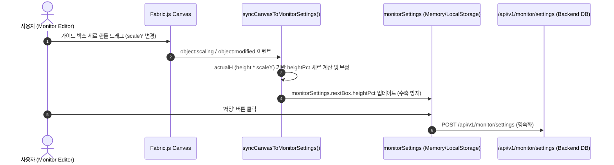

# Technical Design: CHG-037-fix-monitor-textbox-height-resizing

## 1. 개요 및 설계 목표

모니터 에디터(`editor-monitor.js`)에서 `fabric.Textbox` 객체의 자체 높이 자동 계산(Auto-height fit) 기능으로 인해 발생하던 다음 문제를 해결한다:
1. 1줄/빈 슬라이드 텍스트일 때 가이드 박스 높이(`heightPct`)가 텍스트 높이만큼 자동 축소되는 현상 방지.
2. 캔버스 상에서 세로 핸들 조작 시 `scaleY: 1` 초기화와 함께 텍스트 높이로 다시 쪼그라들거나 원상복구되는 현상 수정.
3. 텍스트 내용의 길이와 독립적으로 유저가 설정한 가이드 박스 높이(`heightPct`)가 고정 보장되도록 개선.

## 2. 상세 모듈 설계

### 2.1 `frontend/js/modules/editor-monitor.js`

#### A. 가이드 박스 생성 및 렌더링 (`enterMonitorMode` / `updateBox`)
- `currentGuideBox` 및 `nextGuideBox` 생성 시 유저 설정 `heightPct`를 기반으로 가이드 박스 영역 높이를 추적하는 속성(`customHeightPct` 등) 바인딩.
- 텍스트 변경이나 탭 재진입 시 텍스트 내용 길이(줄 수)에 상관없이 `heightPct` 기준 영역이 보존되도록 함.

#### B. 스케일 및 좌표 정규화 (`syncCanvasToMonitorSettings`)
- 가이드 박스 리사이즈 이벤트 발생 시:
  - `actualW = boxObj.width * (boxObj.scaleX || 1)`
  - `actualH = boxObj.height * (boxObj.scaleY || 1)`
  - 수직 리사이즈 시 `scaleY`의 변형 비율을 감지하여 유저가 세로를 끌어 늘렸을 때 `heightPct`가 정상적으로 증가 및 갱신되도록 개선.
  - 세로 스케일 리셋(`scaleY: 1`) 적용 후에도 직전 계산된 `heightPct`가 수축되지 않도록 수직 최소 높이(최소 5% ~ 기존 42%) 및 세로 스케일 반영 로직 교정.

### 2.2 `frontend/js/viewer.js` 및 모니터 뷰어
- 백엔드/프론트엔드 공통 DB 모델 및 REST API 스키마(`leftPct`, `topPct`, `widthPct`, `heightPct`)는 기존 수치를 100% 호환 적용.
- `viewer.js`의 `renderMonitorViewerLayout`은 이미 `heightPct`를 수신 받아 `style.height = (heightPct/100) * screenH`로 렌더링하므로, 에디터에서 정규화된 `heightPct`가 저장되면 즉시 동일 크기로 올바르게 반영됨.

## 3. 데이터 흐름 및 시퀀스

## 4. 사이드 이펙트 및 회귀 방지책

- `fabric.Textbox`의 폰트 크기 조정(`fontSize`) 기능과 세로 박스 리사이즈(`heightPct`) 기능이 서로 간섭하지 않도록 스케일 계산 분리.
- 메인 슬라이드 에디터 캔버스는 변경 대상에 포함되지 않으므로 영향 없음.
