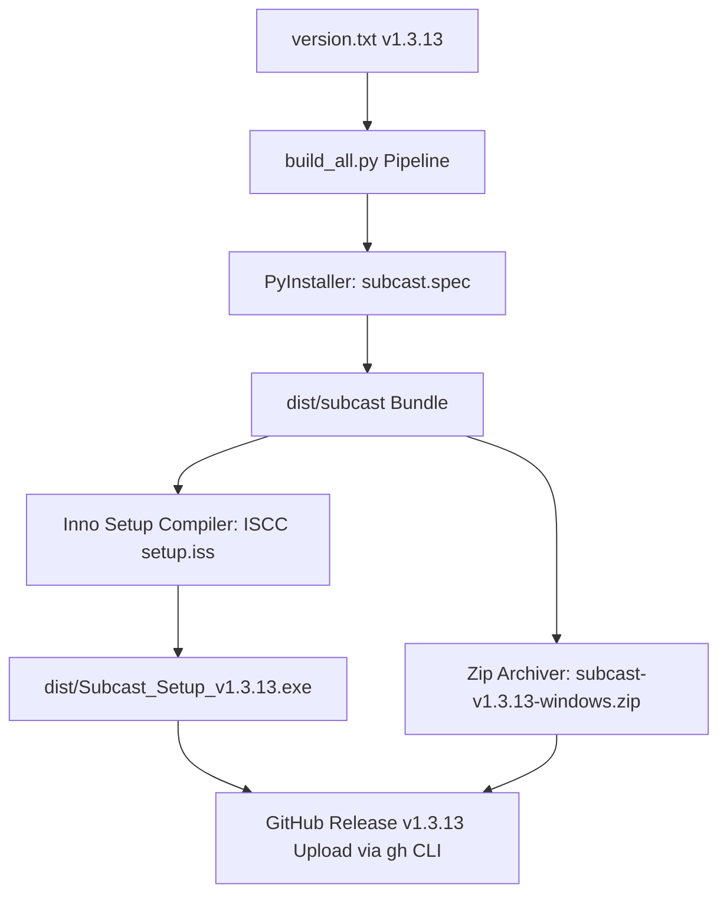

# Technical Design: CHG-039-enterprise-installer-and-release-packaging

## 1. 개요 및 설계 목표
본 변경안은 기업형 단일 EXE 인스톨러 배포, 별도의 EXE 재설치 없이도 백엔드를 통한 무설치 인앱 자동 업데이트(Auto-Update) 지원, 사용자 데이터 마이그레이션 안전성 확보, 개발 데이터 제외, 그리고 GitHub CLI (`gh release`)를 통한 자동 업로드를 구현합니다.

## 2. 세부 설계 (Architecture & Build Flow)

### 2.1 데이터 격리 & 마이그레이션 방안
1. **PyInstaller Spec (`subcast.spec`)**:
   - 포함 리소스: `frontend/`, `GAE_Bible.db`, `version.txt`
   - 제외 리소스: 개발자의 개인 프로젝트(`data/projects/*`), 개인 설정, 테스트 로그
2. **Inno Setup Script (`setup.iss`)**:
   - `GAE_Bible.db`: `onlyifdoesntexist` 처리 (기존 사용자 DB 유지)
   - 프로그램 삭제/재설치 시에도 사용자 데이터 안전 보장

### 2.2 GitHub Release 업로드 명령어 설계
- `gh release create v1.3.13 dist/Subcast_Setup_v1.3.13.exe dist/subcast-v1.3.13-windows.zip --title "Subcast v1.3.13" --notes "Enterprise Installer & Auto-Update Release"`
