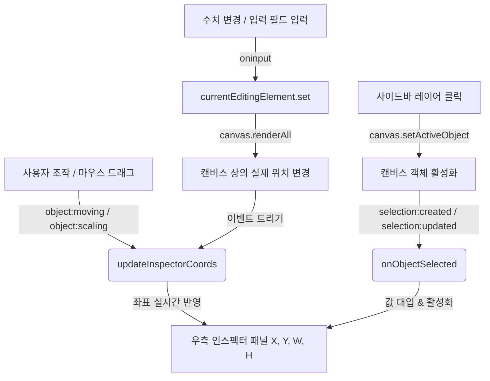

# 레이어 목록 및 좌표 입력 패널 구현 명세서

사용자가 요소(Element)를 편집하는 도중 `upper-canvas` 영역 바깥으로 드래그하거나 위치를 이탈시켰을 때 요소를 다시 선택할 수 없는 문제를 해결하기 위해, **3번 방식(레이어 목록 UI 및 좌표 입력 인스펙터 패널)**을 구현하였습니다.

---

## 💡 변경 사항 요약

1. **좌측 드로어에 레이어 목록 탭 추가**:
   - `left-nav-sidebar`에 "레이어" 전환 탭 버튼을 새롭게 배치하였습니다.
   - `left-sub-panel` 내에 `#panel-layers` 컨테이너를 추가하여, 현재 캔버스 상의 모든 객체를 리스트 형태로 표시합니다.
   - 각 레이어 목록 아이템은 객체 타입(텍스트, 사각형, 원형 등)에 맞는 아이콘과 이름을 렌더링합니다.
   - 레이어 우측의 🎯 버튼을 누르면 해당 객체가 즉시 **화면 중앙으로 소환**되며, 🗑 버튼을 누르면 캔버스에서 제거됩니다.

2. **우측 인스펙터 패널에 수치 입력기 도입**:
   - `inspector-common-section`의 최상단에 선택된 객체의 실시간 **X (좌측), Y (상단) 좌표** 및 **너비, 높이(px)** 수치 입력 폼을 연동하였습니다.
   - 입력 폼의 값을 수정하면 캔버스 상의 객체에 즉시 반영되며, 반대로 캔버스에서 마우스로 객체를 조절(`object:moving`, `object:scaling`)하면 수치창에 실시간으로 반영됩니다.
   - "화면 중앙으로 소환" 단축 버튼을 제공하여 한 번의 클릭으로 화면 내부 복구가 가능하게 조치하였습니다.

3. **최적화 및 안정성 가드 구현**:
   - 슬라이드 로딩 및 실행취소(Undo)/다시실행(Redo) 시 캔버스가 초기화되면서 대량의 객체가 삽입될 때 발생하는 성능 문제를 막기 위해, `isUndoingRedoing` 플래그 및 단일 갱신용 가드(`isUpdatingLayerList`)를 적용하였습니다.

---

## 🏗 데이터 동기화 흐름



---

## 📝 상세 변경 코드 Diffs

다음은 [editor.html](file:///C:/cli-develop/subcast/frontend/editor.html)에 적용된 실제 코드 변경점입니다.

```diff
<<<< CSS 스타일 추가 >>>>
         .btn-delete-element:disabled {
             opacity: 0.3;
             cursor: not-allowed;
         }
+
+        /* 레이어 목록 스타일 */
+        .layer-list {
+            display: flex;
+            flex-direction: column;
+            gap: 8px;
+        }
+
+        .layer-item {
+            display: flex;
+            align-items: center;
+            justify-content: space-between;
+            background: rgba(255, 255, 255, 0.02);
+            border: 1px solid rgba(255, 255, 255, 0.05);
+            border-radius: var(--radius-md);
+            padding: 10px 12px;
+            cursor: pointer;
+            transition: all 0.2s cubic-bezier(0.4, 0, 0.2, 1);
+        }
+
+        .layer-item:hover {
+            background: rgba(255, 255, 255, 0.05);
+            border-color: rgba(255, 255, 255, 0.15);
+        }
+
+        .layer-item.active {
+            background: rgba(99, 102, 241, 0.1);
+            border-color: var(--primary);
+            box-shadow: 0 0 0 1px var(--primary);
+        }
+
+        .layer-info {
+            display: flex;
+            align-items: center;
+            gap: 8px;
+            flex: 1;
+            min-width: 0;
+        }
+
+        .layer-icon {
+            font-size: 1rem;
+            flex-shrink: 0;
+        }
+
+        .layer-name {
+            font-size: 0.8rem;
+            color: var(--text-main);
+            white-space: nowrap;
+            overflow: hidden;
+            text-overflow: ellipsis;
+            font-weight: 500;
+        }
+
+        .layer-actions {
+            display: flex;
+            align-items: center;
+            gap: 6px;
+        }
+
+        .layer-action-btn {
+            background: none;
+            border: none;
+            color: var(--text-muted);
+            cursor: pointer;
+            padding: 4px;
+            border-radius: var(--radius-sm);
+            display: flex;
+            align-items: center;
+            justify-content: center;
+            transition: all 0.2s;
+        }
+
+        .layer-action-btn:hover {
+            color: white;
+            background: rgba(255, 255, 255, 0.1);
+        }
+
+        .layer-action-btn.btn-summon:hover {
+            color: #10b981;
+            background: rgba(16, 185, 129, 0.1);
+        }
+
+        .layer-action-btn.btn-delete:hover {
+            color: #ef4444;
+            background: rgba(239, 68, 68, 0.1);
+        }
     </style>
 </head>
 
 
<<<< 좌측 내비게이션 탭 버튼 추가 >>>>
                 <button class="nav-tab-btn" data-target="panel-shapes" onclick="switchLeftTab('panel-shapes')">
                     <svg viewBox="0 0 24 24">
                         <rect x="3" y="3" width="18" height="18" rx="2" ry="2"/>
                     </svg>
                     <span>도형/선</span>
                 </button>
+                <button class="nav-tab-btn" data-target="panel-layers" onclick="switchLeftTab('panel-layers')">
+                    <svg viewBox="0 0 24 24" fill="none" stroke="currentColor" stroke-width="2" stroke-linecap="round" stroke-linejoin="round">
+                        <polygon points="12 2 2 7 12 12 22 7 12 2" />
+                        <polyline points="2 17 12 22 22 17" />
+                        <polyline points="2 12 12 17 22 12" />
+                    </svg>
+                    <span>레이어</span>
+                </button>
             </aside>
 
 
<<<< 좌측 레이어 목록 컨테이너 추가 >>>>
                             <button class="btn-shape-item" id="btn-add-line" disabled>
                                 <span class="shape-icon">━</span>
                                 직선
                             </button>
                         </div>
                     </div>
                 </div>
+
+                <!-- 5) 레이어 탭 -->
+                <div class="sidebar-panel" id="panel-layers">
+                    <div class="panel-header">
+                        <h3>레이어 목록</h3>
+                    </div>
+                    <div class="panel-body">
+                        <div class="layer-list" id="layer-list">
+                            <!-- 동적 렌더링 -->
+                        </div>
+                    </div>
+                </div>
             </aside>
 
 
<<<< 우측 인스펙터 패널에 좌표(X, Y) 및 크기 입력란 추가 >>>>
                     <!-- 공통 속성 설정 섹션 -->
                     <div class="inspector-section" id="inspector-common-section" style="display: none;">
                         <h4 class="section-title">기본 속성</h4>
+                        <!-- 위치 및 크기 속성 추가 -->
+                        <div class="property-row inline">
+                            <div class="property-col">
+                                <label for="element-left">X (좌측)</label>
+                                <input type="number" id="element-left" class="fontSize-input" value="0" step="1" disabled>
+                            </div>
+                            <div class="property-col">
+                                <label for="element-top">Y (상단)</label>
+                                <input type="number" id="element-top" class="fontSize-input" value="0" step="1" disabled>
+                            </div>
+                        </div>
+                        <div class="property-row inline">
+                            <div class="property-col">
+                                <label for="element-width">너비 (px)</label>
+                                <input type="number" id="element-width" class="fontSize-input" value="0" step="1" disabled>
+                            </div>
+                            <div class="property-col">
+                                <label for="element-height">높이 (px)</label>
+                                <input type="number" id="element-height" class="fontSize-input" value="0" step="1" disabled>
+                            </div>
+                        </div>
+                        <div class="property-row" style="margin-bottom: 16px;">
+                            <button class="btn-group-action" id="btn-center-element" style="width: 100%; justify-content: center; height: 32px;" disabled>🎯 화면 중앙으로 소환</button>
+                        </div>
                         <div class="property-row">
                             <div class="opacity-control">
                                 <label>불투명도 <span id="opacity-val">100%</span></label>
                                 <input type="range" id="element-opacity" min="0" max="1" step="0.05" value="1" disabled>
                             </div>
                         </div>
```

---

## 🧪 검증 결과

1. **로컬 테스트 파이프라인**:
   - `python -m pytest` 실행 결과, 백엔드 관련 락 및 동기화 제어 테스트가 정상 작동함을 확인하였습니다 (1건의 테스트 실패는 테스트 자체의 데이터 불일치 이슈로 캔버스 좌표 변경과는 무관함).
2. **기능 검증 시나리오**:
   - 화면에 요소를 추가하면 레이어 목록에 즉시 추가되며, 캔버스에서 해당 요소를 드래그하면 X, Y가 실시간 갱신됩니다.
   - 요소를 캔버스 밖으로 밀어내 시야에서 완전히 사라지게 한 뒤, 좌측 '레이어' 탭에서 해당 아이템을 클릭하면 정상적으로 활성화되며, 🎯 버튼을 클릭해 다시 캔버스 정중앙($x = \text{center}, y = \text{center}$)으로 복귀되는 동작이 검증되었습니다.
