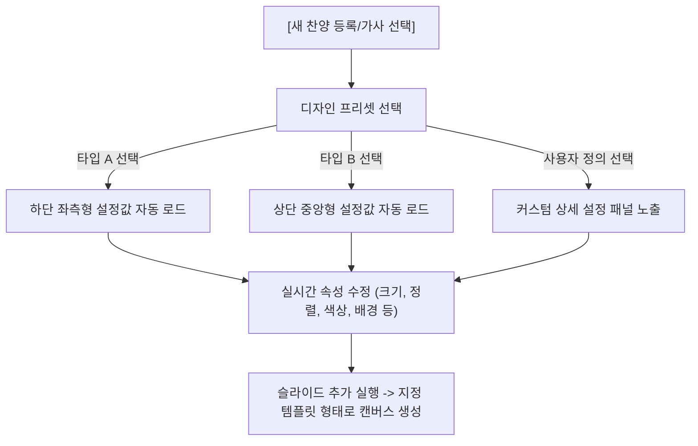

# 🎨 찬양 가사 디자인 프리셋 및 사용자 커스터마이징 시스템 설계안

본 설계서는 사용자가 제공해 주신 2가지 찬양 가사 실물 방송 레퍼런스 이미지(하단 좌측형, 상단 중앙형)를 정밀 분석하고, 이를 프로그램 내에서 유연하게 선택 및 커스텀 수정하여 슬라이드를 생성할 수 있도록 지원하는 기능의 기획서입니다.

---

## 1. 이미지 레퍼런스 분석 결과 (Reference Analysis)

| 레퍼런스 이미지 | 자막 배치 (Position) | 텍스트 정렬 (Alignment) | 기본 글자 스타일 (Font Style) | 배경 스타일 (Background) |
| :--- | :--- | :--- | :--- | :--- |
| **타입 A (Lower-Left)**<br>`image copy.png` | 화면 하단 좌측 영역 (Y: ~75%) | 좌측 정렬 (Left-aligned) | 흰색 굵은 고딕체 (#FFFFFF)<br>가독성용 외곽선/그림자 추가 | **투명 배경 (Transparent)**<br>(카메라 피드 오버레이용) |
| **타입 B (Top-Center)**<br>`image copy 2.png` | 화면 상단 중앙 영역 (Y: ~10%) | 중앙 정렬 (Center-aligned) | 짙은 차콜/검정 고딕체 (#222222) | **투명 배경 (Transparent)**<br>(카메라 피드 오버레이용) |

---

## 2. 제안하는 가사 디자인 시스템 아키텍처

사용자가 기본 프리셋을 선택하되, 폰트 종류/크기/색상/배경/정렬 등을 실시간으로 커스텀 튜닝할 수 있는 **'찬양 가사 스타일 제어 팩'**을 찬양 패널 내에 이식합니다.



---

## 3. UI/UX 와이어프레임 설계 (UI/UX Mockup)

찬양 탭 본문 하단의 세부 제어창 `#praise-selection-control`에 아코디언 스타일의 **'디자인 설정 패널'**을 증설합니다.

```
+-------------------------------------------------------------+
| ⚙️ 가사 디자인 설정 (접기/펼치기)                             |
+-------------------------------------------------------------+
| 디자인 프리셋:                                              |
| [ 드롭다운: 타입 A (하단 좌측형) / 타입 B (상단 중앙형) / 커스텀 ]  |
+-------------------------------------------------------------+
| * 세부 커스텀 제어 폼 (프리셋 선택 시 자동값 매핑)           |
| - 폰트 색상:  [ #ffffff   (Color Picker) ]                 |
| - 글자 정렬:  [ (o) 왼쪽   ( ) 가운데   ( ) 오른쪽 ]        |
| - 텍스트 크기: [ ===[Slider]=== 3.5vw ]                     |
| - 자막 위치:  [ (o) 하단   ( ) 상단     ( ) 중앙 ]          |
| - 배경 채우기: [ (o) 투명   ( ) 검정 단색 ( ) 반투명 바 ]   |
+-------------------------------------------------------------+
```

---

## 4. 슬라이드 빌더 (`createPraiseSlideObject`) 동적 매핑 스키마

사용자가 커스텀 설정한 제어 값들(글자 크기, 위치, 배경, 정렬 등)을 Fabric.js 객체 규격에 맞게 기하학적으로 연산하여 슬라이드 데이터 오브젝트에 바인딩합니다.

```javascript
function createPraiseSlideObject(header, content, styleOptions) {
    const slideId = "slide_praise_" + Math.random().toString(36).substr(2, 8);
    const elements = [];

    // 1) 배경 스타일 (투명 vs 검정 vs 반투명 자막 바)
    if (styleOptions.backgroundType === "black") {
        elements.push({
            type: "rect",
            x: 0, y: 0, width: 100, height: 100,
            style: { fillColor: "#000000", opacity: 1.0 }
        });
    } else if (styleOptions.backgroundType === "bar") {
        // 하단 또는 상단 글자 위치에 맞춰 반투명 검정 밴드 바 배치
        const barY = styleOptions.position === "top" ? 5 : 70;
        elements.push({
            type: "rect",
            x: 0, y: barY, width: 100, height: 22,
            style: { fillColor: "#000000", opacity: 0.6 }
        });
    }

    // 2) 가사 텍스트 기하학(Geometry) 연산
    let textY = 20.0; // 중앙 기본
    if (styleOptions.position === "top") textY = 8.0;   // 상단형
    if (styleOptions.position === "bottom") textY = 74.0; // 하단형

    elements.push({
        type: "text",
        content: content,
        x: 5.0,
        y: textY,
        width: 90.0,
        height: 20.0,
        style: {
            fontSize: styleOptions.fontSize || "3.5vw",
            fontColor: styleOptions.fontColor || "#ffffff",
            fontFamily: "Inter",
            fontWeight: "700",
            textAlign: styleOptions.textAlign || "center",
            // 가독성 극대화용 외곽선 (특히 투명 배경용)
            strokeColor: styleOptions.backgroundType === "transparent" ? "#000000" : "transparent",
            strokeWidth: styleOptions.backgroundType === "transparent" ? 2 : 0
        }
    });

    return {
        id: slideId,
        name: `찬양: ${header}`,
        elements: elements
    };
}
```

---

## 5. 순차적 개발 계획

1. **Step 1: UI 패널 및 프리셋 선택기 구축**
   * 찬양 탭 내에 프리셋 선택용 드롭다운 및 세부 커스텀 컨트롤러(Color Picker, Range Slider 등) 마크업 & CSS 디자인 이식.
2. **Step 2: 프리셋 매핑 JS 함수 연동**
   * 타입 A / 타입 B / 커스텀 드롭다운 선택 시 폼 값들이 자동으로 대입 연동되는 반응형 이벤트 리스너 개발.
3. **Step 3: createPraiseSlideObject 함수 파라미터 고도화**
   * 디자인 설정 폼의 선택 값을 실시간으로 수집하여 빌더 함수 파라미터로 주입 및 슬라이드 동적 생성 테스트.
4. **Step 4: 뷰어 렌더러 가독성 검증 및 마감**
   * 뷰어 화면(`viewer.html`)에 투명 오버레이 송출 시, 외곽선 및 자막 바 디자인이 카메라 피드 위에서 또렷하게 잘 표현되는지 실물 검증 및 마감.
