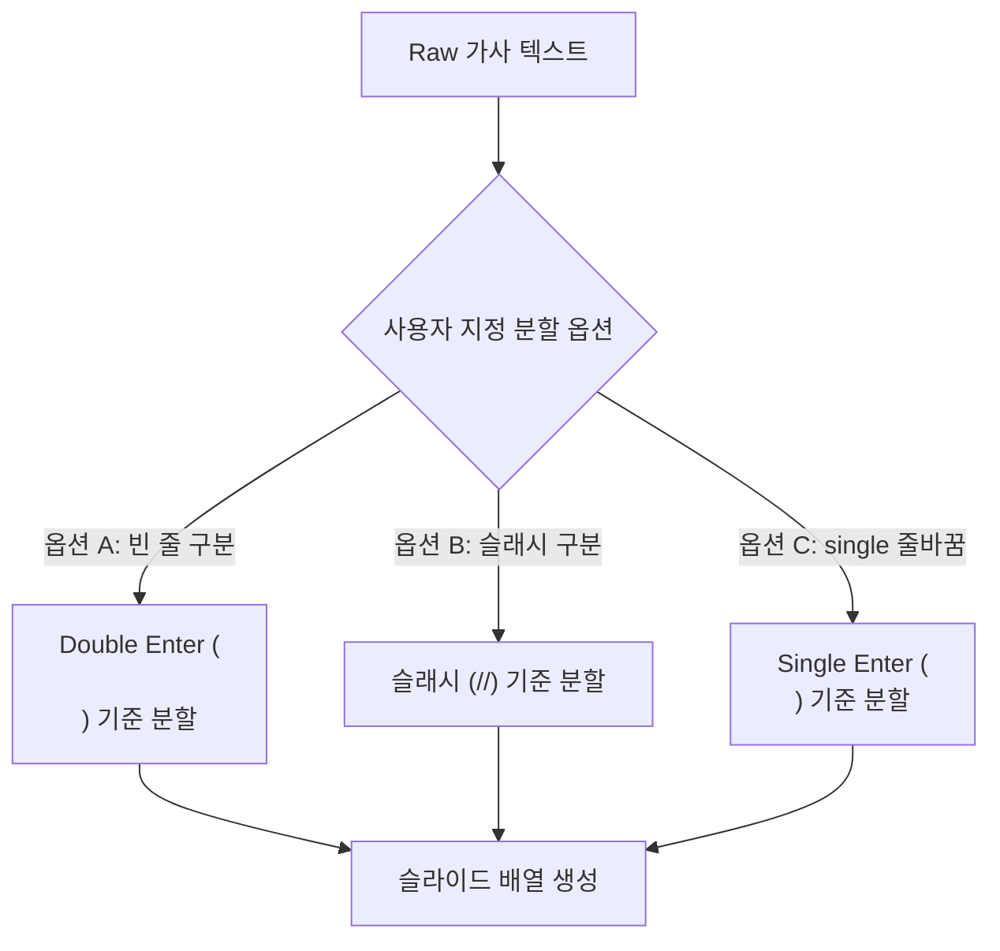

# 🎵 찬양 가사 통합 관리 및 슬라이드 변환 연동 설계 계획서

이 문서는 사용자가 찬양곡 가사를 수동으로 입력하거나 기 등록된 데이터베이스에서 실시간으로 검색하여 쉽고 빠르게 송출용 슬라이드로 변환 및 끼워넣기 삽입을 진행할 수 있도록 돕는 **'찬양 탭'** 기능에 대한 아키텍처 및 UI/UX 설계 계획서입니다.

---

## 1. 핵심 요구사항 요약 (Summary of Requirements)

1. **찬양 탭 레이아웃**: 좌측 드로어 패널 영역에 성경 탭과 대등한 형태의 독자적인 찬양 탭 탑재.
2. **하이브리드 가사 분할 기능**: 사용자가 가사를 직접 작성하거나 붙여넣을 때, 엔터(개행) 및 특정 구분자 기호를 사용해 슬라이드 단위를 자동으로 끊어주는 파서 설계.
3. **가사 데이터베이스 영속화**: 한 번 생성 및 등록된 찬양은 영구 보관하여 데이터 중복 생성 최소화.
4. **통합 검색 자동완성**: 노래 제목은 물론 가사 내용까지 포함한 실시간 자동완성 검색 기능 제공.
5. **무중단 슬라이드 추가**: 성경 기능과 일관되게, 가사 슬라이드 추가 시 "4*X 슬라이드 삽입 모달"을 띄워 원하는 곳에 슬라이드를 직접 끼워 넣는 동선 유지.

---

## 2. 가사 입력 및 슬라이드 분할 파싱 규칙 제안 (Lyrics Parsing Rules)

가사를 슬라이드 단위로 분할하여 개별 오브젝트로 쪼갤 때, 아래의 세 가지 모드를 사용자가 토글식으로 골라 쓸 수 있는 **하이브리드 분할 파서(Hybrid Split Parser)**를 제안합니다.



### 💡 파싱 모드 세부안
* **방법 A. 빈 줄 기준 분할 (Double Enter - ⭐️ 적극 추천)**:
  * 가사 텍스트 작성 중 **엔터를 연달아 두 번 입력하여 빈 행(`\n\n`)**이 생기면 다음 슬라이드 장으로 구분합니다.
  * 예시:
    ```text
    1절 첫 번째 줄 가사
    1절 두 번째 줄 가사
    (이곳을 비워둠으로써 슬라이드 분할)
    2절 첫 번째 줄 가사
    2절 두 번째 줄 가사
    ```
  * **장점**: 메모장이나 가사 사이트에서 긁어와 붙여넣을 때 가장 보편적이고 타이핑 시 기호 입력을 요구하지 않아 가장 부드럽습니다.
* **방법 B. 구분 기호 기준 분할 (`/` 또는 `//`)**:
  * 노트CG 등 기존 교회 자막 툴에서 범용적으로 사용하는 구분선 방식으로, 슬래시 2개(`//`)를 기준으로 다음 슬라이드 장으로 구분합니다.
  * 예시: `내 마음에 주를 향한 사랑이 // 나의 말과 행동속에 넘쳐나네`
  * **장점**: 가사를 한 줄로 콤팩트하게 늘어놓고 빠르게 입력하여 보관할 때 매우 강력합니다.
* **방법 C. 단일 행 분할 (Single Enter)**:
  * 엔터 한 번(`\n`)이 칠 때마다 즉각 슬라이드 한 장을 만듭니다. 
  * **장점**: 아주 짧은 숏폼 자막이나 영문 가사를 1줄씩만 배치하여 쪼갤 때 유용합니다.

---

## 3. UI/UX 와이어프레임 설계 (UI/UX Layout Design)

좌측 aside 드로어 패널 내부의 `#panel-praise` 영역 구조입니다.

```
+-------------------------------------------------------------+
| 🎵 찬양 가사 관리                                            |
+-------------------------------------------------------------+
| [ 찬양 곡 통합 실시간 검색 ]                                 |
| [ input-praise-search        (제목 or 가사 입력)        ]  |
|  * 검색창 하단에 매칭 결과가 부유식 팝업으로 리스트업       |
+-------------------------------------------------------------+
| [ 찬양 입력 폼 ]                                            |
| 제목: [ input-praise-title   (예: 내 마음에 주를 향한) ]    |
| 가사 입력란:                                                |
| +---------------------------------------------------------+ |
| | textarea-praise-lyrics                                  | |
| |                                                         | |
| +---------------------------------------------------------+ |
| 분할 기준: (o) 빈 줄(\n\n)   ( ) 슬래시(//)   ( ) 줄바꿈(\n)|
+-------------------------------------------------------------+
| [ 예상 슬라이드 개수 미리보기: 0 장 ]                       |
| <btn-praise-db-save (DB 저장)>                              |
| <btn-add-praise-slides (선택 영역에 슬라이드 추가)>         |
+-------------------------------------------------------------+
```

---

## 4. 데이터베이스 및 서버 API 설계 (Database & Server API Architecture)

기존 `GAE_Bible.db` 파일 내부에 새 테이블을 증설하거나 별도의 `praise_songs.db` SQLite 인프라를 구축하여 연동합니다. 여기서는 성경 DB와 격리하여 프로젝트 파일들과 함께 가볍게 유지될 수 있는 별도 테이블 또는 동일 SQLite 파일 내 테이블 설계를 정의합니다.

### 🗄️ SQLite Table Schema (`praise_songs`)
```sql
CREATE TABLE IF NOT EXISTS praise_songs (
    id INTEGER PRIMARY KEY AUTOINCREMENT,
    title TEXT NOT NULL,                  -- 찬양 제목
    lyrics TEXT NOT NULL,                 -- 가사 원문
    split_mode TEXT DEFAULT 'double_enter',-- 기본 분할 방식 ('double_enter', 'slash', 'single_enter')
    updated_at TIMESTAMP DEFAULT CURRENT_TIMESTAMP
);

-- 검색 성능 향상을 위한 인덱스 지정
CREATE INDEX IF NOT EXISTS idx_praise_title ON praise_songs(title);
CREATE INDEX IF NOT EXISTS idx_praise_lyrics ON praise_songs(lyrics);
```

### 🌐 Backend REST API Endpoints (`backend/main.py`)
1. **찬양 검색 API**
   * **URL**: `/api/praise/search?query=내마음`
   * **Method**: `GET`
   * **동작**: 제목(title) 또는 가사(lyrics) 내용 중 쿼리가 포함된 노래 레코드를 실시간 반환.
2. **찬양 저장 및 수정 API**
   * **URL**: `/api/praise/save`
   * **Method**: `POST`
   * **Payload**: `{"title": "...", "lyrics": "...", "split_mode": "..."}`
   * **동작**: 신규 찬양이면 DB에 insert, 기존 동일 제목의 찬양이 존재하면 update를 수행하여 데이터 유지.

---

## 5. 데이터 처리 및 슬라이드 생성 시나리오 (Operational Flow)

### 🔁 신규 등록 및 추가 흐름
1. 사용자가 텍스트 상자에 새로운 찬양 제목과 가사를 입력합니다.
2. `[DB 저장]` 버튼을 누르면 서버에 전송되어 데이터베이스에 보존되고, 동시에 검색 후보군에 즉시 추가됩니다.
3. `[선택 영역에 슬라이드 추가]` 버튼을 클릭하면, 입력된 가사를 사용자가 선택한 파싱 규칙에 의거하여 `newSlides` 배열로 자동 분할합니다.
4. 성경 기능과 연계되어 **"성경 슬라이드 삽입 위치 선택 모달"**이 동일하게 나타납니다.
5. 사용자가 원하는 중간 위치 썸네일을 누르고 확인을 클릭하면 해당 위치 바로 뒤에 찬양 가사 슬라이드가 검정 배경 자막 오브젝트(fabric.Textbox 기반) 형태로 정합 주입됩니다.

---

## 6. 개발 마일스톤 계획 (Development Roadmap)

1. **Step 1: DB 및 백엔드 라우터 구현**
   * SQLite 테이블 초기화 로직 탑재 및 찬양 검색/저장 API 추가.
2. **Step 2: 프론트엔드 찬양 탭 마크업 및 스타일링**
   * 좌측 패널 드로어 내에 찬양 컨트롤러 배치 및 CSS 그리드 구성.
3. **Step 3: 검색 자동완성 팝업 및 가사 로딩 구현**
   * 제목/가사 복합 자동완성 및 리스트 선택 시 textarea 가사 로드 바인딩.
4. **Step 4: 가사 분할 파서 및 프로젝트 주입 연동**
   * 하이브리드 파서 구현 및 기존 4xX 격자 모달 연동 통합 테스트 진행.
