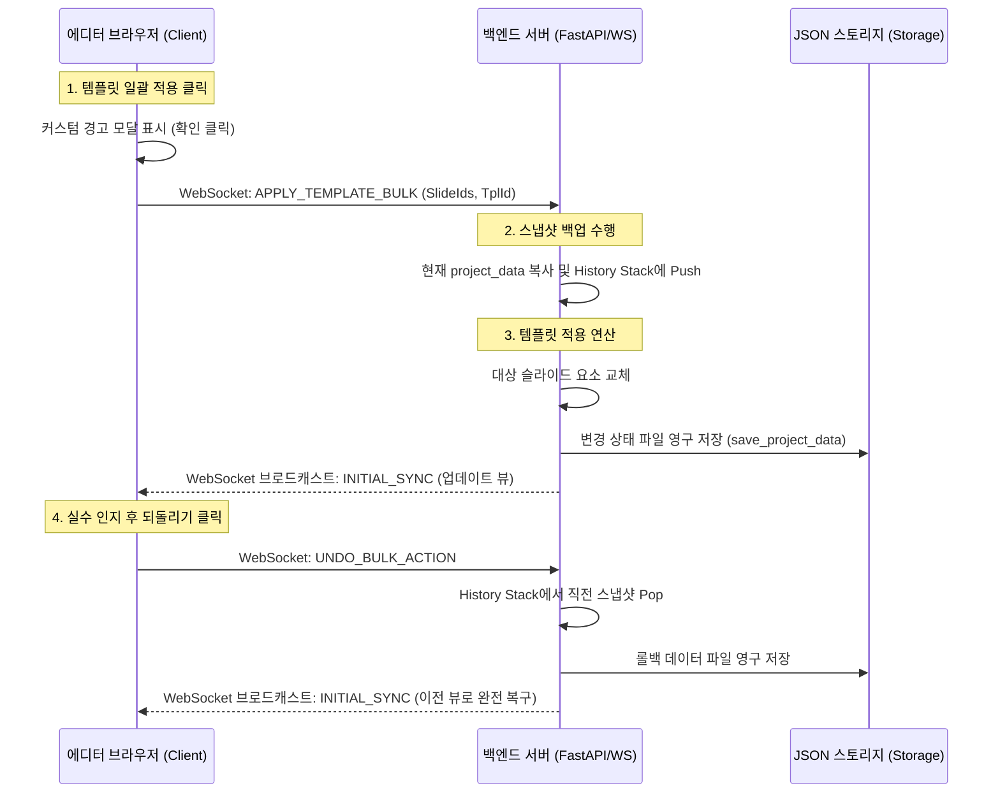

# 디자인 템플릿 적용 고도화 및 되돌리기 구현 계획서
(Design Template Application Enhancement & Undo Implementation Plan)

이 계획서는 사용자가 실시간 자막 송출 시스템에서 디자인 템플릿을 일괄 적용할 때 발생할 수 있는 데이터 손실 위험을 방지하고, 직관적인 다중 선택 및 안전한 되돌리기(Undo)를 지원하기 위한 고도화 구현 방안을 다룹니다.

---

## 1. 개요 및 목적 (Overview & Objective)

현재 시스템은 템플릿 일괄 적용(`APPLY_TEMPLATE_BULK`) 시, 브라우저 기본 경고창(`confirm`)으로 의사를 묻고 선택된 슬라이드의 기존 디자인과 텍스트를 서버 측에서 영구적으로 덮어씌웁니다. 
이 방식은 다음과 같은 문제점을 내포하고 있습니다:
1. **사용성 저하**: 브라우저 순정 경고창은 UI/UX 디자인 일관성을 해치고, 위험성에 대한 상세한 정보를 제공하기 어렵습니다.
2. **복구 불가능성**: 실수로 일괄 적용을 하였을 경우, 기존에 정성껏 작성해 둔 자막 텍스트와 레이아웃이 영구 소실됩니다.
3. **불편한 선택 UI**: 슬라이드가 세로로 길게 나열되는 1열 리스트 형태여서 한 번에 많은 슬라이드를 파악하고 다중 선택하기 어렵습니다.

따라서 **세련된 경고 모달 창(Custom Warning Modal)**과 **슬라이드 목록 격자형(Grid) 레이아웃**을 도입하고, **서버 기반 글로벌 되돌리기(Server-side Undo History)** 메커니즘을 구축하여 안전하고 편리한 템플릿 사용 환경을 조성하고자 합니다.

---

## 2. 사용자 인터페이스 (UI/UX) 설계 및 개선

### 2.1. 슬라이드 목록 격자형(Grid) 레이아웃 개편
*   **기존**: 세로 방향 1열 구조 (`display: flex; flex-direction: column;`)
*   **변경**: 화면 가로 공간을 효율적으로 활용할 수 있도록 반응형 다단 격자형 레이아웃(`display: grid`)으로 CSS 전면 수정.
*   **CSS 명세**:
    ```css
    .slide-list {
        display: grid;
        grid-template-columns: repeat(auto-fill, minmax(110px, 1fr));
        gap: 12px;
    }
    ```
    이 구조를 통해 사용자는 세로 스크롤을 최소화하면서 수십 개의 슬라이드 썸네일을 한눈에 조망할 수 있습니다.

### 2.2. 다중 범위 선택(Shift & Ctrl Selection) 고도화
*   **Shift + 클릭**: 마지막으로 마우스 클릭하여 활성화된 슬라이드 인덱스 $I_{\text{active}}$와 현재 클릭한 슬라이드 인덱스 $I_{\text{clicked}}$ 사이의 모든 슬라이드를 범위 선택합니다.
    *   범위 계산식: $\text{Selected} = \{i \mid \min(I_{\text{active}}, I_{\text{clicked}}) \le i \le \max(I_{\text{active}}, I_{\text{clicked}})\}$
*   **Ctrl + 클릭**: 기존 선택 목록에 영향을 주지 않고 개별 슬라이드를 다중 선택 목록(`selectedSlideIds`)에 추가 또는 제거(토글)합니다.
*   **시각 피드백 강화**: 다중 선택된 슬라이드(`.selected-multi`)의 테두리를 강조색(Primary Color)의 세미 불투명(Semi-opaque) 색상으로 변경하고 테두리 두께를 조절하여 명확한 구분감을 줍니다.

### 2.3. 커스텀 경고 모달 창 (Custom Warning Modal Dialog)
*   **디자인**: 반투명 유리 효과(Glassmorphism) 스타일의 모달 팝업으로 제작합니다.
*   **노출 정보**:
    *   영향을 받는 슬라이드의 개수 및 목록 요약
    *   덮어씌워짐에 따른 데이터 소실 주의 경고 (붉은색 강조 타이포그래피)
    *   "자동 백업이 완료되어 언제든 되돌리기(Undo)가 가능합니다"라는 안심 메시지 표시
*   **인터랙션**: `Enter` 키로 확인(적용), `Esc` 키로 취소가 가능하도록 키보드 포커싱 최적화.

### 2.4. 실행 취소 (Undo) 제어부
*   에디터 상단 툴바에 직관적인 실행 취소(Undo) 버튼(되돌리기 아이콘) 배치.
*   전역 단축키 `Ctrl + Z`가 입력되었을 때, 캔버스 개별 요소의 실행 취소 외에도 "프로젝트 전체 롤백" 명령이 상황에 맞게 트리거되도록 단축키 핸들러 확장.

---

## 3. 아키텍처 및 복구 메커니즘 (Rollback Architecture)

다수의 슬라이드가 서버 데이터베이스 수준에서 한 번에 덮어씌워지므로, 단일 캔버스의 로컬 히스토리(Undo Stack)로는 복구가 불가능합니다. 따라서 **서버 기반 상태 관리** 구조를 적용합니다.

### 3.1. 서버 상태 스냅샷 스택 (Server-side State Snapshot Stack)
*   백엔드(`main.py`)의 `ConnectionManager` 내부에 직전 프로젝트 상태를 보관하는 최대 깊이 $N = 5$의 역사 스택(History Stack) $H$를 구성합니다.
*   일괄 적용 시점 $t_{\text{apply}}$ 직전에 현재의 프로젝트 데이터 $P(t)$를 깊은 복사(Deep Copy)하여 스택에 push합니다.

$$\begin{aligned}
H &\leftarrow H \cup \{ P(t_{\text{apply}}) \} \\
P(t_{\text{new}}) &\leftarrow \text{ApplyTemplate}(P(t_{\text{apply}}), \text{TemplateId})
\end{aligned}$$

*   사용자가 되돌리기를 요청하면 스택에서 $P(t_{\text{apply}})$를 pop하여 현재 활성 프로젝트 데이터로 덮어쓰고, 전체 클라이언트에 `INITIAL_SYNC`를 브로드캐스트합니다.



---

## 4. 상세 변경 범위 및 명세 (Specification Draft)

### 4.1. 프론트엔드 ([editor.html](file:///C:/cli-develop/subcast/frontend/editor.html))
*   **스타일 개편**: `.slide-list` 영역의 grid 속성 부여 및 `.slide-item` 썸네일 비율 매칭.
*   **경고 모달 DOM 구현**:
    *   id가 `template-warning-modal`인 반투명 레이아웃 및 팝업 카드 마크업 추가.
    *   모달 열기/닫기 제어 함수 (`showTemplateWarningModal`, `closeTemplateWarningModal`).
*   **이벤트 핸들러 수정**:
    *   `renderSlides()` 내부의 `item.onclick` 이벤트에 Ctrl 키 토글 조건 분기 추가.
    *   되돌리기 버튼 클릭 혹은 단축키 입력 시 서버로 `UNDO_BULK_ACTION` 타입의 WebSocket 메시지 전송 로직 구현.
*   **동기화 연동**:
    *   서버로부터 복구된 `INITIAL_SYNC` 수신 시 현재 편집 중인 캔버스의 로컬 `undoStack`과 `redoStack`을 안정적으로 재설정하여 화면 깜빡임 및 상태 꼬임 방지.

### 4.2. 백엔드 ([backend/main.py](file:///C:/cli-develop/subcast/backend/main.py))
*   **스냅샷 메모리 큐 구성**:
    *   `ConnectionManager` 클래스 멤버 변수로 `project_history: List[dict] = []` 추가 (최대 길이 5개 제한).
*   **APPLY_TEMPLATE_BULK 분기 수정**:
    *   실제 수정 연산 수행 전, `manager.project_data.model_dump()`를 수행하여 `project_history`에 삽입.
*   **UNDO_BULK_ACTION 신규 핸들러 추가**:
    *   `project_history`가 비어있지 않다면 최신 스냅샷을 꺼내(`pop()`), `manager.project_data`로 다시 역직렬화(Deserialization)하고 디스크에 저장 및 전체 브로드캐스트 수행.

---

## 5. 기대 효과

*   **안전한 작업 보장**: 벌크 덮어쓰기라는 고위험 동작 수행 시 발생할 수 있는 휴먼 에러(Human Error)를 완벽하게 차단합니다.
*   **격자 뷰를 통한 가독성**: 세로 스크롤에 의존하던 긴 슬라이드 리스트를 가로-세로 2차원 격자로 전환하여 조작 및 배치 시인성을 높입니다.
*   **강력해진 다중 선택**: Shift와 Ctrl 단축키의 정교한 조합으로 대량의 슬라이드에 대한 일괄 작업을 신속하고 간편하게 처리합니다.

---

## 6. 공식 참조 문서 (Citations)
*   [CSS Grid Layout MDN Web Docs](https://developer.mozilla.org/ko/docs/Web/CSS/CSS_Grid_Layout) - grid-template-columns 및 반응형 배치 속성
*   [Pydantic v2 Serialization Reference](https://docs.pydantic.dev/latest/concepts/serialization/) - model_dump 및 역직렬화 기법
*   [FastAPI WebSockets Manual](https://fastapi.tiangolo.com/advanced/websockets/) - 실시간 양방향 메시지 설계 표준
*   [W3C Web Application Modal Dialog Design Pattern](https://www.w3.org/WAI/ARIA/apg/patterns/dialog-modal/) - 접근성 및 키보드 이벤트를 충족하는 모달 가이드
