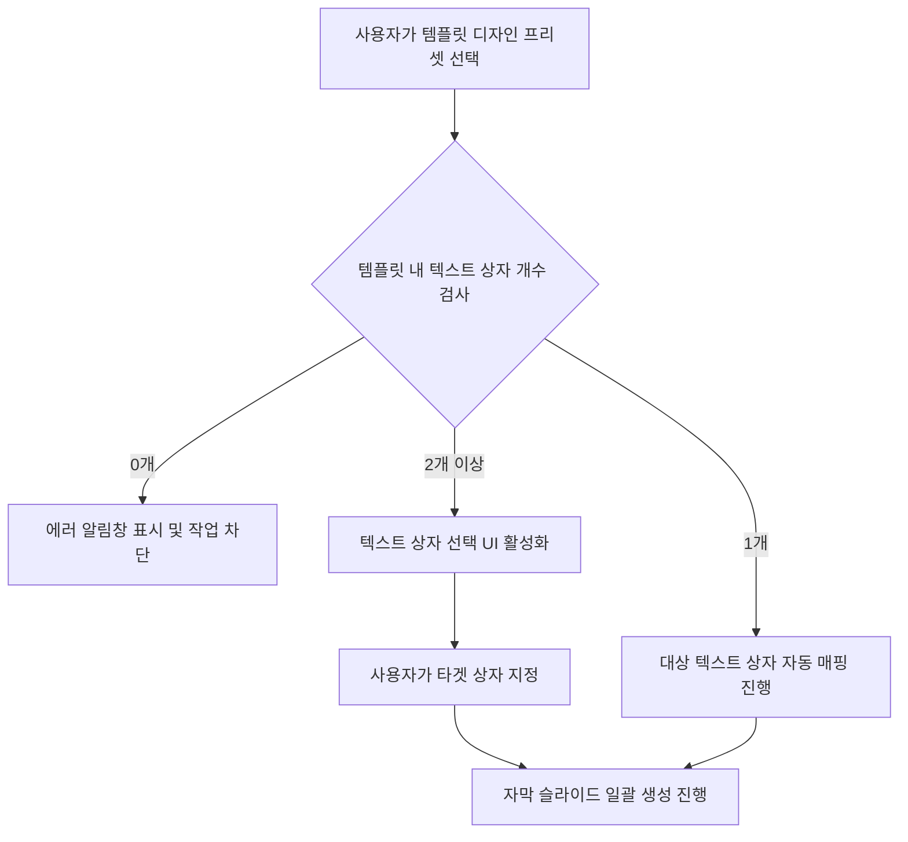

# 범용 다중 텍스트 템플릿 바인딩 시스템 설계 계획서
**Functional Specification: Generic Multi-Textbox Template Binding System**

---

## 1. 기획 배경 및 목적 (Background & Objectives)
본 설계 계획서는 기존의 찬양 가사 전용 슬라이드 생성 알고리즘의 도메인 종속성(Domain Dependency)을 탈피하고, 사용자가 디자인한 다중 텍스트 박스 템플릿에 어떠한 텍스트 데이터(설교, 성경 구절, 프레젠테이션 스크립트, 행사 자막 등)도 안전하고 명시적으로 매핑할 수 있도록 시스템을 일반화(Generalization)하는 것을 목적으로 합니다. 

'가사'라는 한정된 용어 대신 **'자막 본문 텍스트(Subtitle Content Text)'** 및 **'대상 텍스트 상자(Target Text Element)'** 등 범용적인 기술 용어(Terminology)를 채택하고, 레이아웃 충돌을 방지하기 위해 사용자에게 선택권을 제공하는 명시적 제어 흐름(Explicit Control Flow)을 구축합니다.

---

## 2. 시스템 아키텍처 및 바인딩 모델 (System Architecture & Binding Model)

### 2.1. 데이터 매핑 로직 (Data Mapping Logic)
템플릿 내의 모든 텍스트 레이어 집합을 $T = \{t_1, t_2, \dots, t_n\}$이라 정의하고, 사용자가 입력한 본문 텍스트 단락의 배열을 $C = [c_1, c_2, \dots, c_M]$ ($M$은 생성할 총 슬라이드 수)이라 합니다.

사용자는 복수의 텍스트 레이어 중 본문 데이터가 유입될 타겟 인덱스 $k \in \{1, 2, \dots, n\}$를 명시적으로 지정합니다. 최종 생성되는 슬라이드 집합 $S = \{s_1, s_2, \dots, s_M\}$ 내의 각 슬라이드 $s_j$에 포함되는 엘리먼트들의 변경 식은 다음과 같이 정의됩니다.

$$t_i.\text{content} = 
\begin{cases} 
c_j & \text{if } i = k \ \text{(사용자가 선택한 타겟 텍스트 상자)} \\
t_i.\text{content} & \text{if } i \neq k \ \text{(템플릿의 원래 디자인 텍스트 유지)}
\end{cases}$$

### 2.2. 예외 처리 매트릭스 (Exception Handling Matrix)
* **$|T| = 0$ (텍스트 박스가 없는 템플릿):** 
  * 적용이 불가능함을 사용자에게 얼럿으로 경고하고 작업을 취소합니다.
  * *UI 문구:* `"선택한 디자인 템플릿에 자막 텍스트를 대입할 수 있는 텍스트 상자가 존재하지 않습니다. 다른 템플릿을 선택해 주세요."`
* **$|T| = 1$ (텍스트 박스가 1개인 템플릿):**
  * 사용자 선택 과정 없이 해당 텍스트 레이어를 $t_{\text{target}}$으로 자동 지정하여 슬라이드를 생성합니다.
* **$|T| \ge 2$ (텍스트 박스가 여러 개인 템플릿):**
  * 사용자가 대입할 타겟 텍스트 레이어를 명시적으로 고를 수 있는 동적 선택 인터페이스(Select Box)를 노출합니다.

---

## 3. UI/UX 및 제어 흐름 설계 (User Experience Flow)



### 3.1. 마크업 및 스타일 가이드
* **디자인 프리셋 드롭다운 옵션:** `"사용자 템플릿 적용"`
* **템플릿 선택기 노출 시:** 템플릿 드롭다운 아래에 `display: none` 상태이던 **'자막 텍스트 대입 상자 선택기'** 영역이 노출됩니다.
* **표시 예시:**
  ```
  [디자인 프리셋] ─────────────── [ 사용자 템플릿 적용 ▼ ]
  [템플릿 선택] ───────────────── [ 자막 스타일 01   ▼ ]
  [자막 텍스트 대입 상자] ──────── [ 텍스트 박스 1 (본문 입력...) ▼ ]
  ```

---

## 4. 프론트엔드 코드 수정 계획 (Technical Modification Spec)

### 4.1. [frontend/editor.html] 수정 대상 범위

#### ① 마크업 레이아웃 추가 (Line 1860 부근)
`select-praise-design-preset` 선택기 바로 아래에 두 개의 동적 드롭다운 컨테이너를 배치합니다.
```html
<!-- 템플릿 선택기 영역 -->
<div id="praise-template-select-container" style="display: none; align-items: center; justify-content: space-between; gap: 6px; border-top: 1px dashed var(--panel-border); padding-top: 8px; margin-top: 2px;">
    <span style="font-size: 0.65rem; color: var(--text-muted);">디자인 템플릿</span>
    <select id="select-praise-user-template" style="padding: 4px 8px; background: var(--bg-dark); border: 1px solid var(--panel-border); color: var(--text-main); border-radius: var(--radius-sm); font-size: 0.7rem; flex: 1; max-width: 150px;"></select>
</div>

<!-- 대입 타겟 텍스트 박스 선택기 영역 -->
<div id="praise-textbox-select-container" style="display: none; align-items: center; justify-content: space-between; gap: 6px; border-top: 1px dashed var(--panel-border); padding-top: 8px; margin-top: 2px;">
    <span style="font-size: 0.65rem; color: var(--text-muted);">대입할 텍스트 상자</span>
    <select id="select-praise-target-textbox" style="padding: 4px 8px; background: var(--bg-dark); border: 1px solid var(--panel-border); color: var(--text-main); border-radius: var(--radius-sm); font-size: 0.7rem; flex: 1; max-width: 150px;"></select>
</div>
```

#### ② 동적 옵션 리프레시 함수 구현
사용자가 템플릿을 변경할 때 해당 템플릿 안의 텍스트 레이어를 추적하여 대입할 텍스트 상자 목록을 동적으로 변경합니다.
```javascript
function updatePraiseTextboxOptions(targetTemplate) {
    const selectBox = document.getElementById("select-praise-target-textbox");
    const container = document.getElementById("praise-textbox-select-container");
    if (!selectBox || !container) return;

    // 1. 텍스트 타입의 엘리먼트만 필터링
    const textElements = targetTemplate.elements.filter(el => el.type === "text");

    if (textElements.length === 0) {
        alert("선택한 디자인 템플릿에 자막 텍스트를 대입할 수 있는 텍스트 상자가 존재하지 않습니다.");
        container.style.display = "none";
        selectBox.innerHTML = "";
        return;
    }

    if (textElements.length === 1) {
        // 텍스트 상자가 1개인 경우 수동 선택이 불필요하므로 선택기 컨테이너를 숨김
        container.style.display = "none";
        selectBox.innerHTML = `<option value="${textElements[0].id}">${textElements[0].content || "텍스트 상자 1"}</option>`;
    } else {
        // 텍스트 상자가 2개 이상인 경우 선택기 노출 및 옵션 빌드
        container.style.display = "flex";
        selectBox.innerHTML = "";
        textElements.forEach((el, index) => {
            const previewText = el.content ? el.content.substring(0, 15) : `텍스트 상자 ${index + 1}`;
            const opt = document.createElement("option");
            opt.value = el.id;
            opt.textContent = `[상자 ${index + 1}] ${previewText}`;
            selectBox.appendChild(opt);
        });
    }
}
```

#### ③ 슬라이드 추가 헨들러 수정 및 생성 로직
기존 플레이스홀더 파싱 구조 대신, 선택된 텍스트 상자의 ID를 조회하여 해당 상자만 본문 텍스트로 오버라이트(Overwrite)하고, 고유 ID들을 재생성합니다.
```javascript
function createSlideFromTemplateExplicit(tpl, header, contentBlock, targetElementId) {
    const slideId = "slide_praise_" + Math.random().toString(36).substr(2, 8);
    const clonedElements = JSON.parse(JSON.stringify(tpl.elements));
    
    clonedElements.forEach(elem => {
        // 충돌 방지를 위한 유니크 ID 재설정
        elem.id = "elem_praise_" + Math.random().toString(36).substr(2, 9);
        
        // 사용자가 명시적으로 지정한 텍스트 박스 ID와 일치할 경우에만 텍스트 대입
        if (elem.type === "text" && elem.originalId === targetElementId) {
            elem.content = contentBlock;
        }
    });

    return {
        id: slideId,
        name: `자막(템플릿): ${header}`,
        elements: clonedElements
    };
}
```

---

## 5. 결론 및 향후 과제 (Conclusion & Next Steps)
이 범용 결합 아키텍처가 적용되면 사용자는 **가사(Lyrics)**뿐만 아니라 대규모 텍스트 자막 데이터 집합을 템플릿의 레이아웃 특징을 보존한 채 즉각적으로 슬라이드화할 수 있습니다. 

본 설계에 동의하시는 경우, 즉각적으로 프론트엔드 이벤트 리스너와 UI 컴포넌트의 통합 수정을 개시하도록 하겠습니다.
